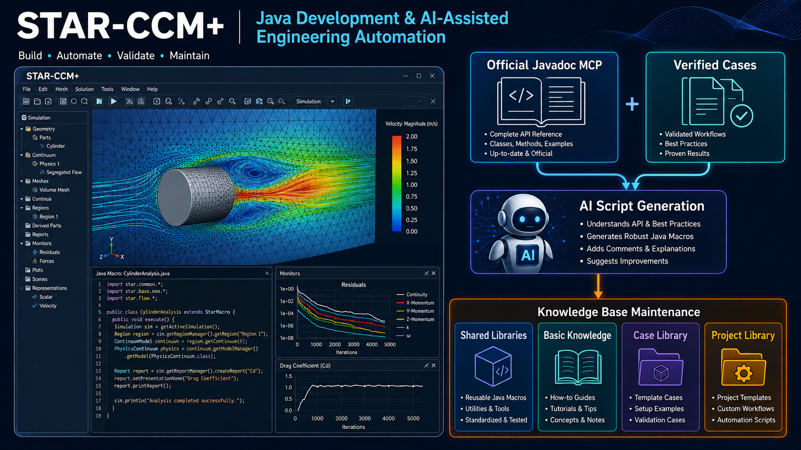
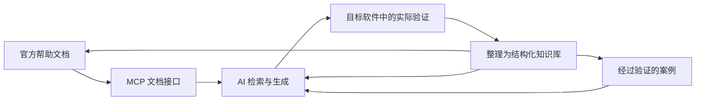
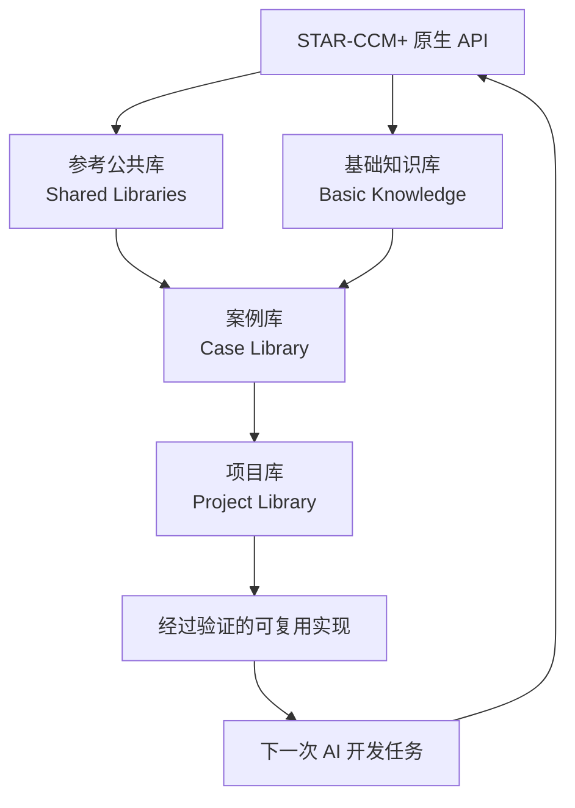
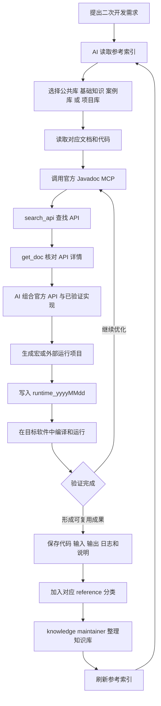

# STAR-CCM+ AI Engineering Workbench

> 官方文档 MCP + 已验证案例 + AI 辅助生成 + 知识库持续演进



这是一个面向 STAR-CCM+ Java 二次开发的 AI 原生工作台。它把官方 Javadoc、可复用公共库、基础知识、软件内功能案例和外部完整项目组织成一个能够持续积累的开发闭环。

```text
官方 Javadoc MCP + 已验证案例
              ↓
          AI 辅助生成
              ↓
       STAR-CCM+ 实际验证
              ↓
       知识库自动整理与索引
              ↓
     验证成果成为下一次开发的参考
```

## 一套可以迁移到任意二次开发项目的方法

STAR-CCM+ 是本仓库的第一个工程示例，但这里真正沉淀的是一套通用的二次开发工作流。只要一个软件或平台具备官方帮助文档、API、示例代码和可执行的验证环境，就可以采用同样的方法：



这套模式可以迁移到：

- ANSYS、Fluent、Abaqus、SpaceClaim 等工程软件；
- CAD、CAE、EDA 和仿真平台的插件开发；
- 企业内部 SDK、业务 API 和自动化平台；
- 任何需要长期维护示例代码、调用规范和运行流程的二次开发项目。

迁移时只需要替换三项内容：权威文档来源、目标软件的验证环境、以及与项目对应的参考资料分类。MCP、AI Skill、验证案例和知识库维护的整体思想保持不变。

## 为什么知识库维护是 AI 工作流的一部分

在 AI 时代，知识库不仅用于保存文件，更承担着“为 AI 提供可检索上下文”的职责。目录名称、文件组织、案例摘要、输入输出和验证状态，都会影响 AI 对资料的选择。

因此，知识库需要持续保持清晰的语义边界：每份资料说明它解决的功能，每个案例对应明确的使用场景，每个项目保留完整的执行关系，验证过的结果可以被下一轮开发复用。

人类可以通过经验补全目录中的信息；AI 更依赖结构化索引和明确文档来建立判断。长期维护知识库，就是在持续提升 AI 检索、理解、生成和复用代码的准确性。

## 四类参考资料

### 1. 参考公共库

目录：`references/Shared_STARCCM_Libraries/`

这里存放对 STAR-CCM+ 原生 API 的公共封装。公共库把重复、繁琐或容易出错的底层调用整理成可被多个宏和项目复用的组件，例如 MacroUtils。

### 2. 基础知识库

目录：`references/Basic_Syntax/`

这里介绍 Java 和 STAR-CCM+ 原生 API 的基本用法，包括宏结构、对象访问、物理模型、网格、报告、场景和求解控制等知识点。基础知识帮助用户和 AI 建立稳定的 API 使用基础。

### 3. 案例库

目录：`references/Standalone_STARCCM_Functions/`

这里存放可以在 STAR-CCM+ 内部运行，并完成一个明确功能的宏案例。案例配套功能总结、输入、输出、适用条件和详细 Mermaid 工作流，便于 AI 依据实际用途选择参考。

### 4. 项目库

目录：`references/External_STARCCM_Runners/`

这里存放从外部完整调用 STAR-CCM+ 的项目，包括启动软件、传入 Simulation 或其他输入、执行多个步骤、保存结果以及处理日志。项目库保留完整的外部执行关系，适合自动化和批量计算场景。



## MCP 如何参与脚本生成

`tools/starccm-javadoc-mcp` 将用户本机 STAR-CCM+ 安装目录中的官方 Javadoc 提供给 AI。生成脚本时，AI 可以：

1. 通过 `search_api` 查找类、方法和关键词；
2. 通过 `get_doc` 读取完整签名、参数、返回值和官方说明；
3. 读取 `references/STARCCM_References_Index.csv` 选择相关资料；
4. 深入阅读对应的 `AGENTS.md`、`README.md`、Java 文件和输入文件；
5. 对照官方 API 和已验证案例生成宏或外部运行项目；
6. 把生成结果写入桌面的 `runtime_yyyyMMdd` 目录，进行实际编译和运行验证。

官方 Javadoc 保留在用户自己的 STAR-CCM+ 安装中，不随本仓库分发。

## AI Skills

### `starccm-script-generator`

用于生成 STAR-CCM+ Java 宏和外部运行项目。它读取参考索引，选择与目标功能最接近的案例，再结合官方 Javadoc MCP 生成带有注释和使用说明的代码。生成结果默认位于：

```text
Desktop/runtime_yyyyMMdd/
├─ java/
├─ inputs/
├─ logs/
└─ README.md
```

### `starccm-knowledge-maintainer`

用于维护参考知识库的结构、语义和索引。它可以检查案例功能边界、项目完整性、重复实现、历史版本、输入输出说明、Mermaid 工作流和索引路径，并在维护任务结束时刷新 `STARCCM_References_Index.csv`。

## 整个仓库的工作流程



随着用户使用 Skill 的次数增加，经过真实环境验证的脚本、输入文件、运行日志和解决方案可以持续沉淀回 `references/`。这样，知识库会从参考资料集合逐渐成长为面向 AI 的项目经验库。

## 快速开始

### 获取仓库

需要 Windows PowerShell、Node.js 18+、已安装并授权的 STAR-CCM+，以及支持本地 stdio MCP server 的 AI 客户端。

```powershell
git clone https://github.com/HBGuo-0903/starccm-ai-engineering-workbench.git
Set-Location .\starccm-ai-engineering-workbench
```

### 安装 Skills

```powershell
$RepoRoot = (Resolve-Path ".").Path
$CodexSkillRoot = Join-Path ([Environment]::GetFolderPath('UserProfile')) '.codex\skills'
New-Item -ItemType Directory -Path $CodexSkillRoot -Force | Out-Null
Copy-Item -LiteralPath (Join-Path $RepoRoot 'tools\skills\starccm-script-generator') -Destination $CodexSkillRoot -Recurse -Force
Copy-Item -LiteralPath (Join-Path $RepoRoot 'tools\skills\starccm-knowledge-maintainer') -Destination $CodexSkillRoot -Recurse -Force
```

### 配置并连接 MCP

```powershell
$RepoRoot = (Resolve-Path ".").Path
Set-Location (Join-Path $RepoRoot 'tools\starccm-javadoc-mcp')
npm install
$env:STARCCM_DOC = 'C:\Path\To\STAR-CCM+\doc\client\html'
```

`STARCCM_DOC` 应指向包含 `index.html`、`type-search-index.js` 和 `member-search-index.js` 的官方 Javadoc 目录。

以 Claude Code 为例：

```powershell
$RepoRoot = (Resolve-Path "..\..").Path
$McpRoot = Join-Path $RepoRoot 'tools\starccm-javadoc-mcp'
claude mcp add --scope user starccm `
  -- cmd /c node (Join-Path $McpRoot 'server.mjs') $env:STARCCM_DOC
claude mcp list
```

## 参考索引

`references/STARCCM_References_Index.csv` 是 AI 进入知识库的第一入口。普通脚本生成任务只读取索引；`starccm-knowledge-maintainer` 负责调用下面的脚本刷新索引：

```powershell
& ".\tools\skills\starccm-knowledge-maintainer\scripts\generate-references-index.ps1"
```

索引使用相对于 `references/` 的路径，因此仓库克隆到其他电脑后仍然有效。

## 开源边界

- 参考案例来自公开 GitHub 项目，来源记录在对应案例的 `README.md` 或 `AGENTS.md` 中；
- `MacroUtils` 来源于 [frkasper/MacroUtils](https://github.com/frkasper/MacroUtils)；
- `StarClasses_Helper_Library` 来源于 [cj8q5/Java_Classes_StarCCM](https://github.com/cj8q5/Java_Classes_StarCCM)；
- `starccm-javadoc-mcp` 的具体许可证和说明以 `tools/starccm-javadoc-mcp/` 内文件为准；
- Siemens STAR-CCM+ 软件、官方 Javadoc、许可证密钥和本机运行目录由用户自行提供。

提交新的参考资料时，请让它具备清晰的功能名称、来源、适用范围和验证信息，使人和 AI 都能快速理解并复用。
