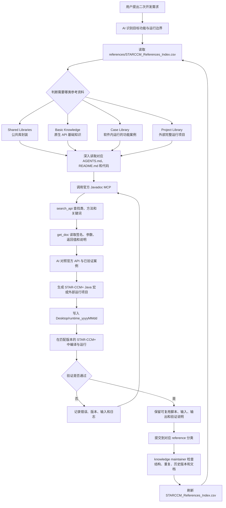
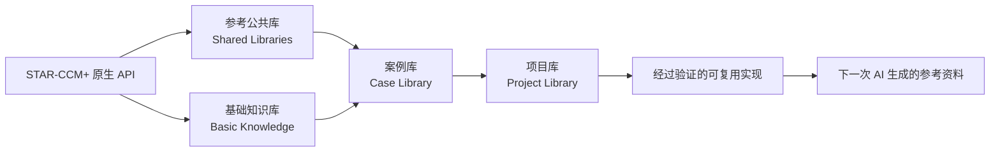

# STAR-CCM+ Java Development

> 让 AI 真正“查得到 API、看得懂案例、写得出宏、理得清资料”。


这是一个面向 STAR-CCM+ Java 二次开发的 AI 原生参考仓库。它把三类能力串成一条可复用的链路：

**官方 Javadoc MCP + 已验证案例 → AI 生成 → 知识库运维整理**

它不只是一个 Java 文件收藏夹，也不把 Siemens 的官方文档复制进 GitHub。AI 在需要写宏时，可以查询本机官方 API、参考已经验证过的代码，再把生成结果放到独立的运行目录；知识库维护 Skill 则负责持续检查、分类、去重和刷新索引。

更重要的是，这套思想并不局限于 STAR-CCM+。任何有官方 API、示例代码、运行环境和持续积累需求的二次开发项目，都可以复用同一套方法：把权威文档接入 MCP，把验证过的实现沉淀为案例，让 AI 负责检索与生成，再用自动化规则保持知识库干净。

## 整个仓库的工作闭环

下面的 Mermaid 图描述的是从一次开发需求到知识库长期演进的完整过程：



这意味着仓库不是“资料放进去就结束”，而是一个可以不断变强的闭环：用户使用 Skill 越多，经过 STAR-CCM+ 实际验证的脚本越多，就越可以继续沉淀回 `references/`，成为下一次 AI 生成时更可靠的参考。

## 为什么要这样组织？

STAR-CCM+ Java 开发最容易遇到的不是“不会写一行 Java”，而是：

- API 名称、继承关系和参数经常记错；
- GitHub 案例可能是半成品、旧版本、测试代码，不能直接当作正确答案；
- 案例越积越多以后，目录、文件名、历史版本和重复代码会让 AI 找错资料。

本仓库的目标是让 AI 按下面的路径工作：

```text
本机官方 Javadoc
        │
        ▼
starccm-javadoc-mcp ── search_api / get_doc ──► 准确的 API、签名和说明
        │                                             │
        └──────────────────────┬──────────────────────┘
                               ▼
                 已验证的 STAR-CCM+ 案例与参考索引
                               │
                               ▼
                    AI 生成宏 / 外部运行项目
                               │
                               ▼
                 knowledge maintainer 持续整理知识库
```

## 四类参考资料

为了让人和 AI 都能快速判断资料用途，我们把参考资料明确分为四类：

### 1. 参考公共库

`Shared_STARCCM_Libraries/` 存放对 STAR-CCM+ 原生 API 的公共封装。它们把重复、繁琐或容易写错的底层调用整理成更容易复用的库，例如 MacroUtils。公共库不是某一个具体工况的完整案例，而是多个宏和项目都可以调用的基础设施。

### 2. 基础知识库

`Basic_Syntax/` 用来介绍 Java 和 STAR-CCM+ 原生 API 的基础知识。这里只保留适合单独学习的知识点；如果一段代码只是非常简单的语法示例，就不把它包装成复杂案例。

### 3. 案例库

`Standalone_STARCCM_Functions/` 存放可以在 STAR-CCM+ 内单独运行、并且能够完成某个明确功能的宏案例。每个案例应当尽量对应单一功能，并说明输入、输出、适用条件和足够详细的 Mermaid 执行流程。

### 4. 项目库

`External_STARCCM_Runners/` 存放从外部完整调用 STAR-CCM+ 的项目，例如启动软件、传入 Simulation 或其他输入、执行多个步骤、保存结果和处理日志。外部项目应当整体保留，不能把同一项目拆成零散 Java 文件后混入 STAR-CCM+ 内部宏案例。



## 三个核心能力

### 1. 用 MCP 读取官方帮助文档

`tools/starccm-javadoc-mcp` 把本机 STAR-CCM+ 安装目录中的官方 Javadoc 暴露给 AI。AI 可以先用 `search_api` 找类、方法或关键词，再用 `get_doc` 读取正式文档，从而核对：

- 类和接口是否真实存在；
- 方法的完整签名、参数和返回值；
- 继承关系以及可用的 STAR-CCM+ 对象；
- 版本差异、弃用信息和调用限制。

这样，AI 不需要凭记忆猜 API，也不会把网上某个版本的示例直接当成当前版本的官方事实。官方 Javadoc 仍然保留在用户自己的 STAR-CCM+ 安装中，不随本仓库分发。

### 2. 参考已经验证过的案例

`references/` 是面向 AI 检索的案例知识库，而不是按 GitHub 仓库简单堆放的备份。它使用上面的四类模型：

- `Shared_STARCCM_Libraries/`：原生 API 的公共封装；
- `Basic_Syntax/`：原生 API 和 Java 基础知识；
- `Standalone_STARCCM_Functions/`：在 STAR-CCM+ 内运行的单功能案例；
- `External_STARCCM_Runners/`：从外部完整调用 STAR-CCM+ 的项目。

AI 每次先读取 `references/STARCCM_References_Index.csv`，再按任务深入读取相关目录中的 `AGENTS.md`、`README.md`、Java 文件和输入文件。索引让 AI 先知道“有哪些资料”，案例文档再说明“这些资料为什么可信、如何运行、输入输出是什么”。

### 3. AI 辅助生成，并持续自动整理

安装 `starccm-script-generator` 后，可以直接让 AI：

- 结合官方 Javadoc MCP 查询正确 API；
- 从索引中选择最接近的已验证案例；
- 生成带注释的 STAR-CCM+ 宏或外部运行项目；
- 把脚本放进桌面的 `runtime_yyyyMMdd` 目录，便于编译、运行和回溯。

安装 `starccm-knowledge-maintainer` 后，可以让 AI 检查知识库是否出现：

- 同一项目的历史版本和重复文件；
- 本应归为基础语法、却被包装成完整案例的简单代码；
- 一个案例目录中混入多个独立功能；
- 外部集群、FSI、Co-Simulation 等不应放在独立宏分类中的内容；
- 缺少功能总结、输入、输出和详细 Mermaid 工作流的案例说明；
- 索引路径失效、空目录和无关的图片或构建产物。

这正是 AI 时代知识库运维的关键：人类通常还能凭经验读懂一个凌乱的目录，但 AI 会把目录结构、文件命名和元数据当成检索线索。知识库一旦变脏、变乱，AI 就可能选错案例、重复生成代码，甚至把测试脚本当成生产流程。因此，长期整理不是“锦上添花”，而是让 AI 稳定工作的基础设施。

## 目录结构

```text
starccm-java-development/
├─ assets/
│  └─ starccm-ai-mcp-workflow.png
├─ references/
│  ├─ Basic_Syntax/
│  ├─ Standalone_STARCCM_Functions/
│  ├─ External_STARCCM_Runners/
│  ├─ Shared_STARCCM_Libraries/
│  ├─ AGENTS.md
│  └─ STARCCM_References_Index.csv
├─ tools/
│  ├─ skills/
│  │  ├─ starccm-script-generator/
│  │  └─ starccm-knowledge-maintainer/
│  └─ starccm-javadoc-mcp/
├─ AGENTS.md
└─ README.md
```

## 快速开始

### 1. 获取仓库

需要 Windows PowerShell、Node.js 18+、已安装并授权的 STAR-CCM+，以及支持本地 stdio MCP server 的 AI 客户端。

```powershell
git clone https://github.com/<your-account>/starccm-java-development.git
Set-Location .\starccm-java-development
```

### 2. 安装 AI Skills

把仓库中的两个 Skill 安装到当前用户的 Codex Skill 目录：

```powershell
$RepoRoot = (Resolve-Path ".").Path
$CodexSkillRoot = Join-Path ([Environment]::GetFolderPath('UserProfile')) '.codex\skills'
New-Item -ItemType Directory -Path $CodexSkillRoot -Force | Out-Null
Copy-Item -LiteralPath (Join-Path $RepoRoot 'tools\skills\starccm-script-generator') -Destination $CodexSkillRoot -Recurse -Force
Copy-Item -LiteralPath (Join-Path $RepoRoot 'tools\skills\starccm-knowledge-maintainer') -Destination $CodexSkillRoot -Recurse -Force
```

安装后可以对 AI 这样说：

```text
使用 starccm-script-generator，先查官方 Javadoc，再参考已验证案例，生成一个创建圆柱体并设置网格的宏。

使用 starccm-knowledge-maintainer，检查 references 中与场景和可视化相关的案例，识别重复、空目录和多功能混杂问题。
```

### 3. 连接官方 Javadoc MCP

先安装 MCP 项目依赖：

```powershell
$RepoRoot = (Resolve-Path ".").Path
Set-Location (Join-Path $RepoRoot 'tools\starccm-javadoc-mcp')
npm install
```

设置本机官方 Javadoc 根目录。它应当是包含 `index.html`、`type-search-index.js` 和 `member-search-index.js` 的目录：

```powershell
$env:STARCCM_DOC = 'C:\Path\To\STAR-CCM+\doc\client\html'
```

以 Claude Code 为例注册 MCP：

```powershell
$RepoRoot = (Resolve-Path "..\..").Path
$McpRoot = Join-Path $RepoRoot 'tools\starccm-javadoc-mcp'

claude mcp add --scope user starccm `
  -- cmd /c node (Join-Path $McpRoot 'server.mjs') $env:STARCCM_DOC

claude mcp list
```

其他 AI 客户端的配置格式可能不同，但核心仍然是：启动 `tools/starccm-javadoc-mcp/server.mjs`，并把本机 Javadoc 根目录作为参数传入。连接后可用下面的请求测试：

```text
使用 search_api 查找 RegionManager，再用 get_doc 读取官方文档，并说明创建一个新 Region 时应调用哪些 API。
```

### 4. 让 AI 生成可运行结果

推荐让 AI 明确遵循这条链路：

```text
提出功能需求
  ↓
读取 STARCCM_References_Index.csv
  ↓
深入阅读相关 AGENTS.md、README.md、Java 和输入文件
  ↓
通过 MCP 查询官方 API
  ↓
对照已验证案例生成代码
  ↓
写入 Desktop/runtime_yyyyMMdd/
  ↓
在匹配版本的 STAR-CCM+ 中编译和运行验证
```

生成目录默认位于当前用户桌面，例如：

```text
Desktop/runtime_20260906/
├─ java/
├─ inputs/
├─ logs/
└─ README.md
```

运行结果、日志和临时输入留在 `runtime_yyyyMMdd`，不会污染参考知识库。

## 索引与知识库维护

`references/STARCCM_References_Index.csv` 是 AI 检索入口。正常生成脚本时只读取索引；只有 `starccm-knowledge-maintainer` 负责调用索引生成脚本：

```powershell
& ".\tools\skills\starccm-knowledge-maintainer\scripts\generate-references-index.ps1"
```

索引脚本使用相对于 `references/` 的路径，因此仓库克隆到其他电脑后仍然可用。官方 Javadoc、STAR-CCM+ 安装文件、许可证和个人运行目录不进入 Git 仓库。

## 开源来源与边界

- 参考案例来自公开 GitHub 项目，具体来源记录在对应案例的 `README.md` 或 `AGENTS.md` 中。
- `references/Shared_STARCCM_Libraries/MacroUtils` 保留 [frkasper/MacroUtils](https://github.com/frkasper/MacroUtils) 的原始项目内容。
- `references/Shared_STARCCM_Libraries/StarClasses_Helper_Library` 来自 [cj8q5/Java_Classes_StarCCM](https://github.com/cj8q5/Java_Classes_StarCCM)。
- `tools/starccm-javadoc-mcp` 用于查询用户本机的官方 Javadoc，具体许可证和使用说明以其目录内文件为准。
- Siemens STAR-CCM+ 软件、官方 Javadoc、许可证密钥和相关商标不随本仓库分发。

提交新内容前，请先阅读最近目录中的 `AGENTS.md`。尤其要保持完整外部项目的边界，不要把一个外部运行项目拆成零散 Java 文件，也不要把测试、缓存、构建产物和本机绝对路径提交到仓库。
