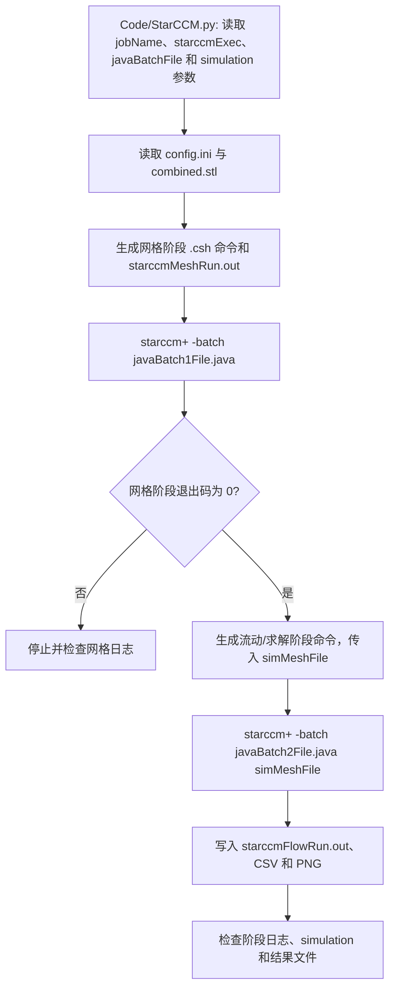

# Batch and Multi-Case Runner

## Summary

本项目通过 Python 驱动器生成 STAR-CCM+ 的批处理命令和多阶段作业脚本，依次执行网格宏与求解宏并传递 simulation 文件，解决多案例运行中命令、许可证参数和阶段衔接需要重复手工维护的问题。

## Input

- `Input_Files\combined.stl`：几何输入。
- `Input_Files\config.ini`：批处理和案例配置。
- 外部环境变量 `STAR_POWER_ON_DEMAND_LIC`、STAR-CCM+ 可执行程序路径和许可证路径。
- 网格宏、求解宏和目标 `.sim` 文件；具体文件名由 `Code\StarCCM.py` 的参数决定。

## Output

- 由 Python 生成的批处理/集群命令和阶段日志。
- 网格阶段产生的 simulation 文件，以及求解阶段产生的 `.csv`、`.png` 和运行日志。
- 运行成功必须同时检查命令退出码、`starccmMeshRun.out`、`starccmFlowRun.out` 和结果文件。

## Workflow

## File Roles

- `Code\StarCCM.py`：主要外部驱动器，生成并组织 STAR-CCM+ 批处理命令。
- `Code\StarDriver.java`、`InitializeGridSequencing.java`、`TxtToCsv.java`：Java 辅助或数据转换代码。
- `Code\STARCCM_BatchScript.py`、`Code\StarCCM.py`：批处理模板和作业生成逻辑。
- `Input_Files`：几何和批处理配置。
- `Documentation`：原项目的运行脚本、报告和参考文件。

## Constraints

- 项目依赖 Linux/C-Shell 或集群环境；不能把 `Code` 中的 Java 文件单独当作 Standalone 宏使用。
- `starccm+` 路径、许可证地址、Power-on-Demand 变量和远程 Shell 参数必须按实际环境修改。
- 归档的测试和文件碰撞副本不属于当前默认运行链。
