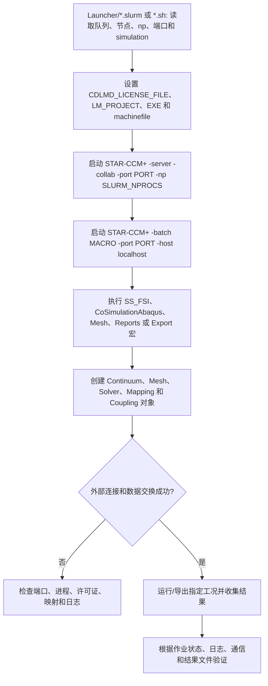

# Co-Simulation and Cluster Workflow

## Summary

本项目通过 Slurm/Shell 启动 STAR-CCM+ Server、加载 FSI 和 Abaqus 协同仿真 Java 宏，再通过端口和映射交换数据，解决外部求解器、集群资源和 STAR-CCM+ 模型必须同步运行的问题。

## Input

- `Code` 中的 FSI、Abaqus、网格、区域、报告、场景、映射和求解器 Java 类。
- `Launcher` 中的 `.slurm`、`.sh`、Python 辅助脚本、STAR-CCM+ 路径、端口和并行参数。
- 目标 `.sim`、Abaqus/外部求解器输入、映射对象和集群资源配置。
- `LM_PROJECT`、许可证地址、队列、节点数、`SLURM_NPROCS` 和工作目录等环境设置。

## Output

- Slurm 作业、STAR-CCM+ Server/Batch 进程和外部协同仿真进程。
- FSI、Abaqus、网格、报告、场景和映射对象的更新结果。
- 作业日志、通信日志、导出场数据和最终 simulation。
- 必须同时检查作业状态、端口连接、STAR-CCM+ 日志、外部求解器状态和结果文件。

## Workflow

## File Roles

- `Code`：STAR-CCM+ Java 宏及其 FSI、Abaqus、网格、求解器和后处理依赖。
- `Launcher`：Slurm、Shell、Python、端口、并行和结果导出启动器。
- 文件名中带版本后缀的旧宏、测试宏和完全重复的 Launcher 文件已移入 `98_Previous_Organization`。
- `README.md`：说明环境、入口和完整运行链。

## Constraints

- 本目录中的 Java 不能脱离 Launcher、外部求解器和集群环境单独迁移到 Standalone。
- 外部项目使用特定 Linux/Slurm、STAR-CCM+、Abaqus、许可证和路径配置，本地 Windows 不能直接照搬。
- 许可证地址、内部主机、`LM_PROJECT` 和端口只能作为环境配置，不得写入真实凭据。
