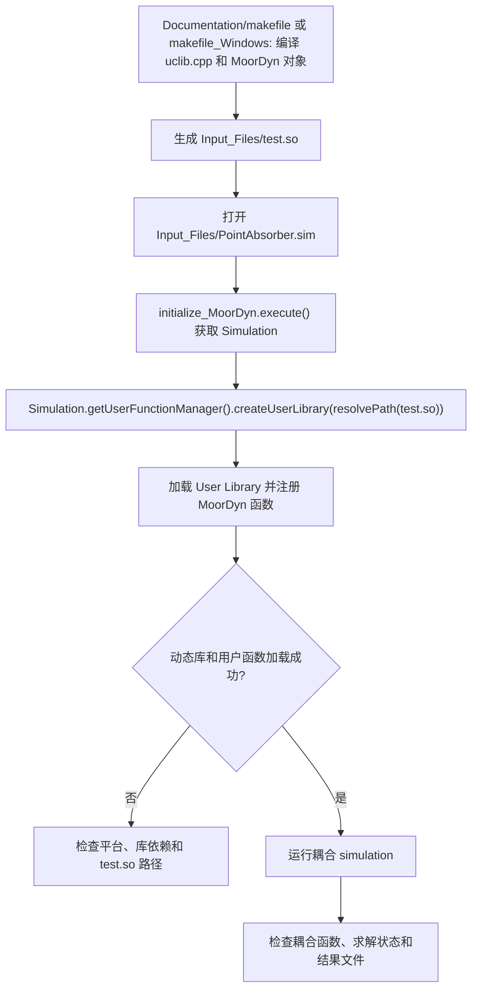

# STAR-CCM+ MoorDyn Coupling

## Summary

本项目通过 STAR-CCM+ 的 User Library 机制加载由 C/C++ MoorDyn 代码编译出的动态库，并由 `initialize_MoorDyn.java` 注册耦合函数，解决浮体系泊动力学模型无法直接接入 STAR-CCM+ 仿真的问题。

## Input

- `Input_Files\PointAbsorber.sim`：目标 STAR-CCM+ simulation。
- `Input_Files\test.so`：由 `Documentation\makefile` 或 `makefile_Windows` 构建的 MoorDyn 动态库；Java 代码通过 `resolvePath(dir+"//test.so")` 加载。
- `Documentation\uclib.cpp`、`uclib.h`、MoorDyn 对象文件和 makefile；编译平台决定使用 Linux 或 Windows 构建文件。

## Output

- STAR-CCM+ User Function Manager 中注册的用户库和 MoorDyn 耦合函数。
- 可继续运行的 `PointAbsorber.sim` 耦合模型。
- 编译日志、动态库加载状态和仿真结果；必须检查库是否加载、函数是否注册以及 simulation 是否能正常推进。

## Workflow

## File Roles

- `Code\initialize_MoorDyn.java`：STAR-CCM+ 内部注册入口。
- `Input_Files\PointAbsorber.sim`：运行模型；`test.so` 是 Java 代码直接引用的动态库。
- `Documentation\uclib.cpp`、`uclib.h`：User Library 与 MoorDyn 的 C/C++ 接口。
- `Documentation\makefile`、`makefile_Windows`：Linux 和 Windows 构建方式。
- `Documentation` 中的 PDF 和文本：耦合模型与编译参考资料。

## Constraints

- `test.so` 不是可随意删除的测试文件；它被 `initialize_MoorDyn.java` 和构建流程实际引用。
- 动态库必须与 STAR-CCM+、操作系统和编译器 ABI 匹配。
- 不要在文档或脚本中保存真实许可证、主机凭据或个人路径。
