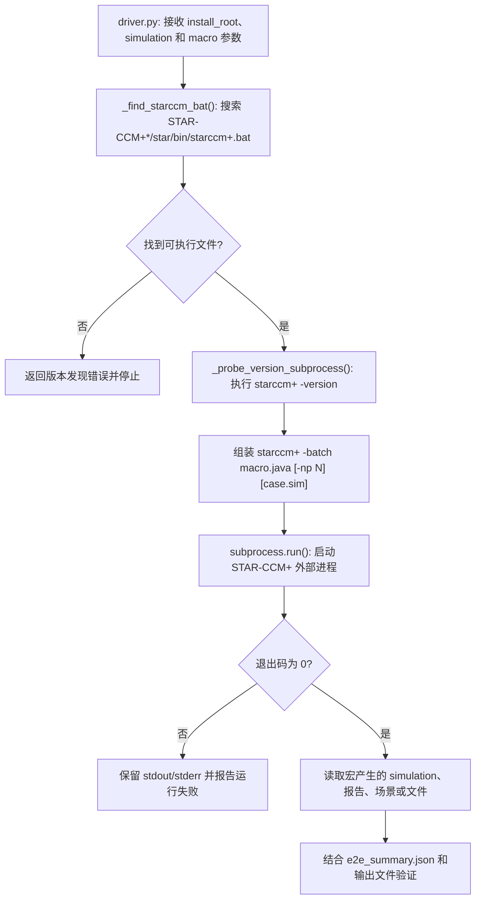

# STAR-CCM+ External Automation Driver

## Summary

本项目通过 Python `driver.py` 查找指定安装目录中的 `starccm+.bat`，调用 `starccm+ -batch` 执行 Java 宏并收集版本和运行结果，解决不同 STAR-CCM+ 安装版本下外部自动发现、启动和验证的问题。

## Input

- `Input_Files\compatibility.yaml`：支持版本和兼容性配置。
- `Input_Files\pyproject.toml`：Python 包、入口点和依赖配置。
- `Input_Files\e2e_summary.json`：端到端测试摘要和测试宏名称。
- Siemens STAR-CCM+ 安装根目录、目标 `.sim` 文件和待执行 Java 宏。

## Output

- 自动发现的 `starccm+.bat` 路径和版本信息。
- 外部进程的退出码、标准输出和标准错误。
- Java 宏生成或修改的 simulation、场景、报告和导出文件。
- 成功判据是可执行程序找到、批处理命令完成、日志无启动错误且目标输出存在。

## Workflow

## File Roles

- `Code\driver.py`：外部发现、版本探测和子进程启动入口。
- `Code\starccm_*.java`：STAR-CCM+ 宏示例和端到端运行对象。
- `Code\test_*.py`、Smoke Test 和负面测试：已移入历史归档，不属于默认运行入口。
- `Input_Files\compatibility.yaml`、`pyproject.toml`、`e2e_summary.json`：运行配置和验证数据。
- `Documentation`：API、兼容性和已知问题说明。

## Constraints

- 必须在安装 STAR-CCM+ 的 Windows 环境中验证；不能把本目录的 Java 宏误当作无依赖的 Standalone 案例。
- 安装路径、版本范围、`.sim` 路径和外部进程参数必须按本机环境修改。
- 测试文件与正式驱动分开维护；更新测试时不得覆盖正式入口。
