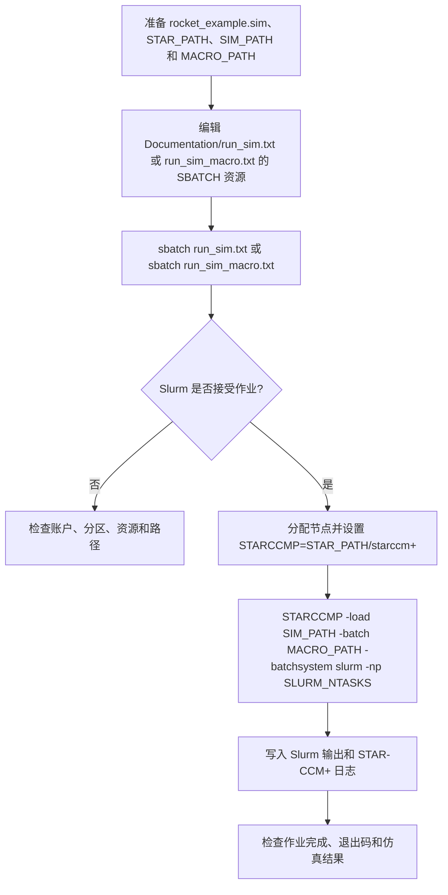

# HPC STAR-CCM+ Scheduler

## Summary

本项目通过 Slurm `sbatch` 分配集群资源，再使用 `STAR_PATH/starccm+` 的 `-batch`、`-np` 或 Design Manager 参数启动 Java 宏和 `.sim`，解决 STAR-CCM+ 仿真在 HPC 队列中的资源申请、并行启动和结果留存问题。

## Input

- `Input_Files\rocket_example.sim`：STAR-CCM+ 仿真输入。
- `Code\main.java`、`Code\rocket_macro.java`：批处理或 Design Manager 相关宏。
- `Documentation\run_sim.txt`、`run_sim_macro.txt`、`runDM.txt`：Slurm 命令和参数模板。
- 集群账户、分区、节点/任务数、`STAR_PATH`、`SIM_PATH`、`MACRO_PATH` 和 Design Manager 工程路径。

## Output

- Slurm 作业编号、队列状态和作业日志。
- Java 宏运行产生的 simulation、网格/求解结果和导出文件。
- Design Manager 运行产生的设计点或参数化结果。
- 必须同时检查 Slurm 状态、STAR-CCM+ 日志、退出码和结果文件。

## Workflow

## File Roles

- `Documentation\run_sim*.txt`：普通仿真和宏批处理模板。
- `Documentation\runDM.txt`、`dmLaunch.txt`：Design Manager/参数化作业模板。
- `Code\main.java`、`rocket_macro.java`：STAR-CCM+ Java 入口或示例。
- `Input_Files\rocket_example.sim`：仿真输入。
- `Documentation` 中的 PDF、文本和工程文件：集群运行参考。

## Constraints

- 当前模板使用特定账户、队列、共享路径和许可证环境，不能在本地 Windows 直接执行。
- `STAR_PATH`、`SIM_PATH`、`MACRO_PATH` 和 Slurm 资源必须替换为目标环境值。
- 不要把账户密码、许可证密钥或集群凭据写入参考文件。
