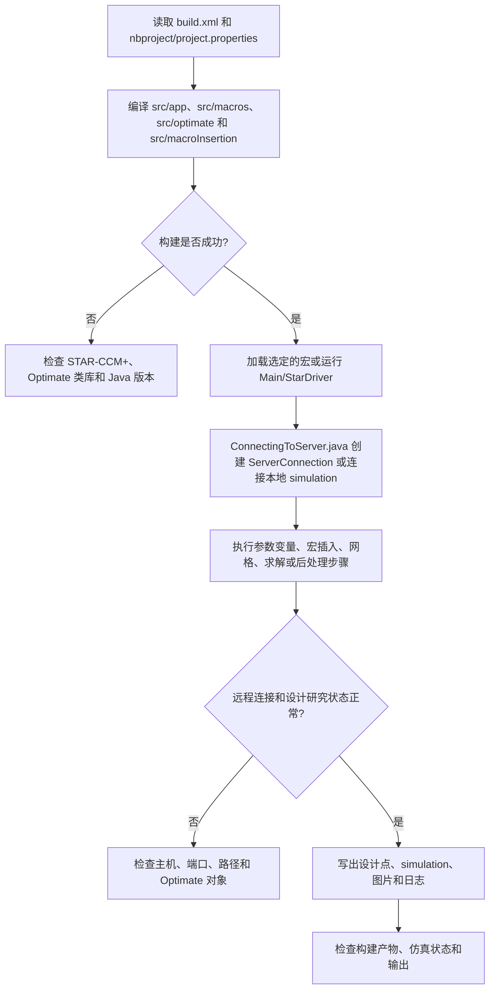

# Optimate STAR-CCM+ Macro Library

## Summary

本项目通过 Ant/NetBeans 构建 Java 宏库，并使用 Optimate API、远程 `ServerConnection` 和宏插入点控制设计研究、参数化建模、求解及后处理，解决 Optimate 工程中宏、工具类和构建依赖分散后无法完整复用的问题。

## Input

- `build.xml`、`nbproject\project.xml` 和 `nbproject\project.properties`：构建配置。
- `src\app\Main.java`：应用入口及构建/运行关联。
- `src\macros`、`src\optimate`、`src\macroInsertion`：设计研究宏、变量、驱动器和插入步骤。
- Optimate/STAR-CCM+ 类库、simulation、设计参数、远程主机和路径配置。

## Output

- 构建产生的宏库或 JAR；运行产生的设计点、更新后的 simulation、图片、日志和后处理结果。
- 远程服务器连接、宏插入和 Optimate 设计研究控制结果。
- 成功必须检查 Ant 构建结果、连接状态、simulation 状态和输出文件。

## Workflow

## File Roles

- `build.xml`、`nbproject`：完整构建和 IDE 项目配置，不能删除或扁平化。
- `src\app`：应用入口。
- `src\macros`：STAR-CCM+ 与 Optimate 宏。
- `src\optimate`：设计变量、驱动器和 Optimate 控制类。
- `src\macroInsertion`：设计研究阶段的宏插入步骤。
- `src\misc`：共享工具、日志和服务器观察器。

## Constraints

- `ConnectingToServer.java`、`CreateProxyServerForRemoteExec.java` 等远程代码必须与整个项目一起保留，不能移入 Standalone。
- `OpenObjectSelector...Fix.java` 和 `...UpdatedAgain.java` 等修复版本已保留最新实现，旧版本已归档。
- Optimate API、STAR-CCM+ 版本、远程主机和原始 Linux 路径必须按实际环境修改。
