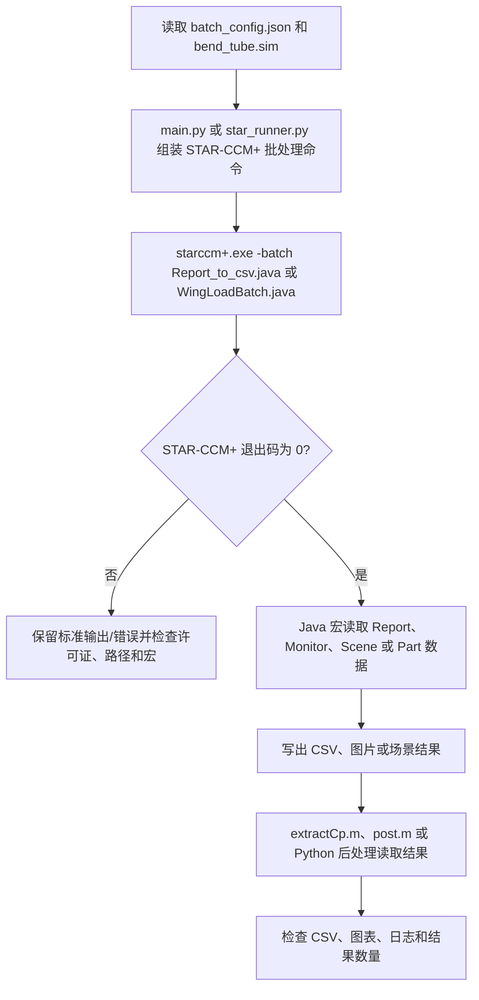

# STAR-CCM+ External Result Extraction

## Summary

本项目通过 Python、MATLAB 和 Java 宏从外部启动 STAR-CCM+，读取 simulation 中的报告、压力系数、翼载荷和场景数据并生成 CSV/图表，解决批量结果提取依赖 GUI 操作且难以复用的问题。

## Input

- `Input_Files\bend_tube.sim`：示例仿真。
- `Input_Files\batch_config.json`：外部批处理配置和 STAR-CCM+ 可执行程序设置。
- `Code\Report_to_csv.java`、`WingLoadBatch.java`、`ExportScenesAndPlots.java`：结果提取宏。
- `Code\star_runner.py`、`main.py`、`extractCp.m`、`post.m`：外部启动和后处理入口。

## Output

- 报告、监视器、压力系数、翼载荷和场景导出文件。
- MATLAB 图表、Python 日志和 STAR-CCM+ 批处理日志。
- 必须检查外部进程退出码、Java 宏输出、CSV 内容和图表是否可读取。

## Workflow

## File Roles

- `Code\star_runner.py`、`main.py`：外部启动和批处理编排。
- `Code\Report_to_csv.java`、`WingLoadBatch.java`、`ExportScenesAndPlots.java`：STAR-CCM+ 结果提取宏。
- `Code\extractCp.m`、`post.m`、`drawExcelChart.m`：MATLAB/图表后处理。
- `Input_Files`：simulation 和批处理配置。
- `Documentation`：演示、后处理说明、工具和参考文件。

## Constraints

- `starccm+.exe`、许可证服务器、MATLAB 和 Python 环境必须按本机修改。
- `pod`、许可证地址和远程路径只能使用环境变量或脱敏占位符。
- `NitroMacro.exe` 是否作为正式后处理工具，需要按实际运行链确认；不能仅凭文件存在判断其为必需依赖。
