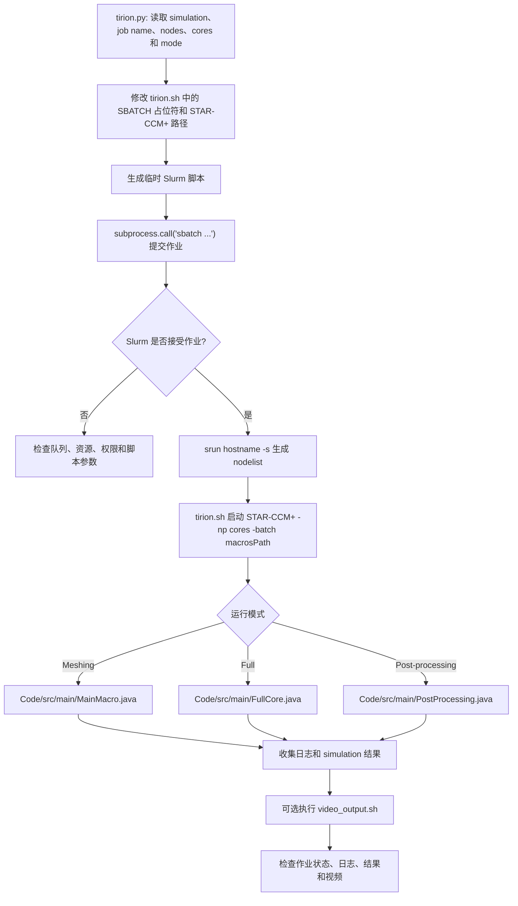

# Tirion STAR-CCM+ Cluster Framework

## Summary

本项目通过 `Launcher\tirion.py` 解析 simulation、节点和核心数，生成并提交 Slurm 作业，再由 `tirion.sh` 启动 STAR-CCM+ 执行主流程或后处理宏，解决 STAR-CCM+ 集群作业参数生成、批处理启动和结果收集需要统一编排的问题。

## Input

- `Launcher\tirion.py` 的 simulation 路径、作业名、节点数、核心数和运行模式参数。
- `Launcher\tirion.sh` 的 Slurm 模板、STAR-CCM+ 路径、队列和宏路径。
- `Code\src\main\MainMacro.java`、`FullCore.java`、`PostProcessing.java`。
- 集群队列、`srun`/`sbatch`、`STAR-CCM+` 可执行文件、工作目录和 simulation 文件。

## Output

- 生成的临时 Slurm 作业脚本和提交结果。
- 作业日志、STAR-CCM+ 日志、simulation 结果和后处理输出。
- 可选的图片序列和 `Launcher\video_output.sh` 生成的视频。
- 成功必须同时确认作业完成、STAR-CCM+ 无错误、宏执行完成且输出文件可读取。

## Workflow

## File Roles

- `Launcher\tirion.py`：参数解析、Slurm 脚本生成和提交入口。
- `Launcher\tirion.sh`：集群资源、节点发现和 STAR-CCM+ 批处理模板。
- `Code\src\main`：当前主流程、完整运行和后处理宏。
- `Code\src\deprecated`：已标记为 deprecated 的历史宏，不属于默认入口。
- `Launcher\video_output.sh`：可选的视频生成步骤。

## Constraints

- 当前脚本依赖 Linux、Slurm 和特定集群路径，本地 Windows 不能直接运行。
- `tirion.sh` 中的队列、节点、核心数、STAR-CCM+ 路径和许可证配置必须按环境修改。
- `src\deprecated` 内容仅作历史参考；新增默认流程不得依赖它。
