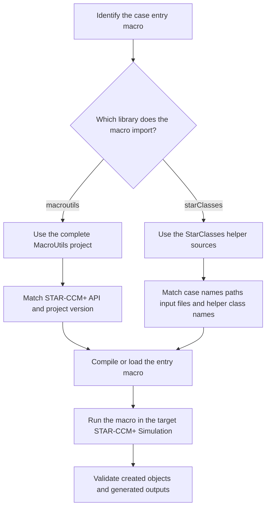

# Shared STAR-CCM+ Libraries

## Scope

本目录只保存可被多个 STAR-CCM+ 案例复用的 Java 公共代码，不保存单个案例的入口宏、案例输入文件或具体仿真结果。当前目录包含两个来源和定位不同的库：`MacroUtils` 是通用 STAR-CCM+ Java 工具项目，`StarClasses_Helper_Library` 是案例级辅助类集合。

## Libraries

### MacroUtils

位置：`MacroUtils`

来源：[frkasper/MacroUtils](https://github.com/frkasper/MacroUtils)

这是完整的原始项目副本，必须保留原始项目结构，不要再拆分成多个库目录。项目中的主要内容包括：

- `macroutils`：STAR-CCM+ 对象的查询、创建、设置、删除、检查、文件读写和模板工具。
- `simassistants/simplehexamesher`：基于 MacroUtils 的 SimpleHexaMesher Simulation Assistant。
- `demos`：MacroUtils 的演示宏。
- `tests`：原始项目测试代码和测试支持文件。
- `build.gradle`、`settings.gradle`、`LICENSE.md`、`README.md`：原始构建、许可证和项目说明文件。

适用场景：多个宏需要重复查找或创建 STAR-CCM+ 对象，或者需要统一处理区域、边界、物理连续体、网格、报告、场景和求解器设置时使用。简单的单 API 示例不需要依赖 MacroUtils，应放在 `Basic_Syntax`。

版本规则：升级 MacroUtils 时整体替换该项目，并确认其 STAR-CCM+ API 版本与当前环境匹配；不得只从其他版本复制几个 Java 文件。

### StarClasses_Helper_Library

位置：`StarClasses_Helper_Library`

来源：[cj8q5/Java_Classes_StarCCM](https://github.com/cj8q5/Java_Classes_StarCCM)

这是面向复杂案例的 `starClasses` 辅助类集合，不是 Siemens 官方库，也不是 STAR-CCM+ 官方帮助文档。它主要把案例中反复出现的流程封装为 Java 类，包括：

- `GeometryBuilder`：几何部件创建和处理。
- `RegionBuilder`：区域和边界创建、组织与设置。
- `ContinuumBuilder`、`ContiuumBuilder`：物理连续体和网格连续体配置；两个名称存在拼写和历史兼容问题，使用前要确认入口宏实际导入哪一个。
- `TrimmerMesher`、`PolyhedralMesher`：网格操作配置。
- `FieldFunctions`：场函数创建和查找。
- `ReportsMonitorsPlots`：报告、监视器和绘图配置。
- `Scenes`：场景和可视化设置。
- `StoppingCriteria`：迭代步数和停止条件设置。
- `SimRunner`：按案例逻辑设置参数、清除解并运行仿真。
- `DataReader`、`NewDataReader`：读取案例外部文本输入。
- `GeoData`、`MeshElementData`、`MeshSpacingData`：保存几何和网格输入参数。
- `DerivedParts`、`SolutionHistoryCreator`、`Tools`：派生部件、解历史和其他案例辅助操作。

适用案例：当前可确认依赖 `starClasses` 的案例包括 `Flat_Plate_With_Boxes`、`Flat_Plate_40mil_LES`、`MAE7440_GLS17`、`NACA_2412`，以及 `External_STARCCM_Runners/CoSimulation_And_Cluster_Workflow` 中的部分协同仿真和 FSI 宏。

使用限制：该库不是完全通用的 API。部分类依赖特定区域名称、报告名称、输入文件格式、网格模型和 STAR-CCM+ 版本。使用前必须检查入口宏的 `import starClasses...`、对象名称、外部输入路径和版本要求。FSI、Abaqus、集群和协同仿真的完整项目仍归 `External_STARCCM_Runners` 管理，不能把其中一部分流程拆到本目录。

## Input

- 与库版本匹配的 STAR-CCM+ Java API。
- 需要使用该库的案例入口宏。
- 案例宏所要求的 Simulation 对象、模型树名称和外部输入文件。
- 如果使用 `MacroUtils` 的 Gradle 构建方式，还需要对应的 JDK、Gradle 和 STAR-CCM+ 库路径。

## Output

- 可供多个案例编译或加载的公共 Java 类。
- 由调用这些类的案例宏创建或修改的 STAR-CCM+ 几何、区域、网格、物理模型、报告、场景和求解状态。

## Workflow

## Maintenance Rules

- 不把具体案例入口宏复制进本目录。
- 不把 `MacroUtils` 拆成 `MacroUtils_Library`、`SimpleHexaMesher_Library` 等平行目录；SimpleHexaMesher 应保留在 MacroUtils 原始项目内部。
- 不把 `StarClasses_Helper_Library` 误写成官方帮助文档或通用 STAR-CCM+ 标准库。
- 不在多个案例目录复制共享库；案例只通过构建配置、类路径或源码路径引用。
- 不混合两个来源的同名类；如果案例需要特定历史版本，应在案例或归档目录中记录版本来源。
- 测试、历史版本和外部集群配套脚本不属于共享库的新增内容；完整外部项目必须整体保留在 `External_STARCCM_Runners`。
