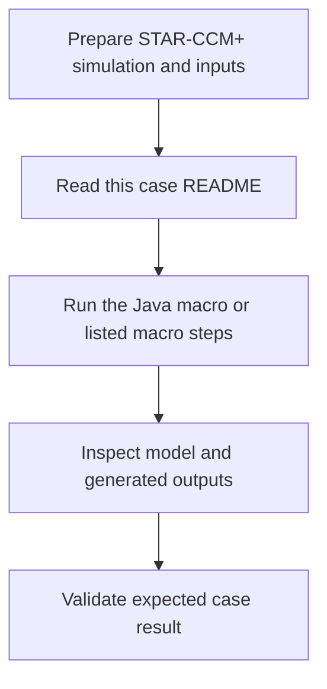

# Case Macro Directory

## Input

- 按本案例 Java 宏中的对象名称、路径和输入文件要求准备 STAR-CCM+ simulation。
- 运行前检查 STAR-CCM+ 版本、当前模型树和宏入口类。

## Output

- 本案例宏在 STAR-CCM+ 中创建或修改的模型对象、求解设置、场景、报告或导出文件。
- 具体输出以 `Code` 中的 Java 文件和本目录名称为准。

## Workflow

## Maintenance

- `Code` 只放适用于本案例/功能单元的 Java 文件。
- 不要把其他案例、测试或历史版本放入本目录。
