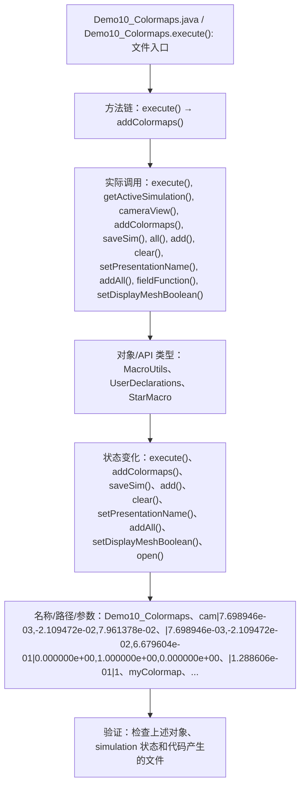

# Case Macro Directory

## Summary

本宏通过在 STAR-CCM+ 中执行 Demo10_Colormaps.execute()，并调用 execute(), getActiveSimulation(), cameraView(), addColormaps(), saveSim(), all(), add(), clear() 操作 MacroUtils、UserDeclarations、StarMacro，实现配置场景、视图和可视化对象以生成可检查的结果，解决场景显示和可视化输出依赖重复手工设置。

## Input

- 已打开的 STAR-CCM+ simulation，以及代码中通过名称获取的已有对象。
- 代码中引用的对象名称或参数：Demo10_Colormaps、cam|7.698946e-03,-2.109472e-02,7.961378e-02、|7.698946e-03,-2.109472e-02,6.679604e-01|0.000000e+00,1.000000e+00,0.000000e+00、|1.288606e-01|1、myColormap、myColormap2、Sphere、Centroid。运行前需确认模型树中名称一致。

## Output

- 被创建、读取或修改的 STAR-CCM+ 对象：MacroUtils、UserDeclarations、StarMacro。
- 代码执行的结果操作：execute()、addColormaps()、saveSim()、add()、clear()、setPresentationName()、addAll()、setDisplayMeshBoolean()、open()。

## Workflow

## Maintenance

- `Code` 只保留属于本功能边界的 Java 文件；如果新增文件不能接入当前执行链，应建立新的功能目录。
- 修改对象名称、输入路径、参数或执行顺序后，必须同步更新本文件的 `Input`、`Output` 和 Mermaid `Workflow`。
