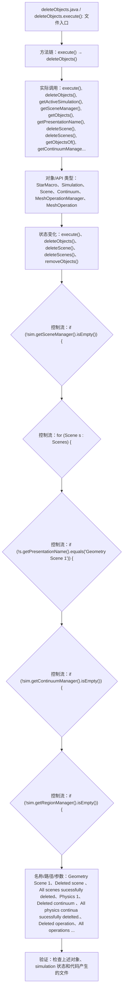

# Case Macro Directory

## Summary

本宏通过在 STAR-CCM+ 中执行 deleteObjects.execute()，并调用 execute(), deleteObjects(), getActiveSimulation(), getSceneManager(), getObjects(), getPresentationName(), deleteScene(), deleteScenes() 操作 StarMacro、Simulation、Scene、Continuum、MeshOperationManager、MeshOperation，实现在 STAR-CCM+ simulation 中执行该功能对应的对象配置和结果处理，解决该类 STAR-CCM+ 模型处理依赖重复手工操作。

## Input

- 已打开的 STAR-CCM+ simulation，以及代码中通过名称获取的已有对象。
- 代码中引用的对象名称或参数：Geometry Scene 1、Deleted scene 、All scenes sucessfully deleted、Physics 1、Deleted continuum 、All physics continua sucessfully detelted.、Deleted operation、All operations sucessfully deleted。运行前需确认模型树中名称一致。

## Output

- 被创建、读取或修改的 STAR-CCM+ 对象：StarMacro、Simulation、Scene、Continuum、MeshOperationManager、MeshOperation。
- 代码执行的结果操作：execute()、deleteObjects()、deleteScene()、deleteScenes()、removeObjects()。

## Workflow

## Maintenance

- `Code` 只保留属于本功能边界的 Java 文件；如果新增文件不能接入当前执行链，应建立新的功能目录。
- 修改对象名称、输入路径、参数或执行顺序后，必须同步更新本文件的 `Input`、`Output` 和 Mermaid `Workflow`。
