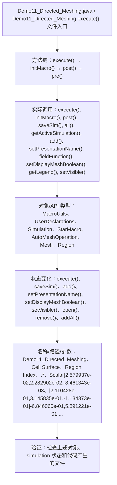

# Case Macro Directory

## Summary

本宏通过在 STAR-CCM+ 中执行 Demo11_Directed_Meshing.execute()，并调用 execute(), initMacro(), post(), saveSim(), all(), getActiveSimulation(), add(), setPresentationName() 操作 MacroUtils、UserDeclarations、Simulation、StarMacro、AutoMeshOperation、Mesh、Region，实现配置并执行几何或网格处理流程，解决网格流程依赖重复的界面操作且容易漏设。

## Input

- 已打开的 STAR-CCM+ simulation，以及代码中通过名称获取的已有对象。
- 代码中引用的对象名称或参数：Demo11_Directed_Meshing、Cell Surface、Region Index、.*、Scalar|2.579937e-02,2.282902e-02,-8.461343e-03、|2.110428e-01,3.145835e-01,-1.134373e-01|-6.846060e-01,5.891221e-01,4.292433e-01、|7.413223e-02|1、Mesh|4.807398e-02,4.265680e-02,3.831531e-02。运行前需确认模型树中名称一致。

## Output

- 被创建、读取或修改的 STAR-CCM+ 对象：MacroUtils、UserDeclarations、Simulation、StarMacro、AutoMeshOperation、Mesh、Region。
- 代码执行的结果操作：execute()、saveSim()、add()、setPresentationName()、setDisplayMeshBoolean()、setVisible()、open()、remove()、addAll()。

## Workflow

## Maintenance

- `Code` 只保留属于本功能边界的 Java 文件；如果新增文件不能接入当前执行链，应建立新的功能目录。
- 修改对象名称、输入路径、参数或执行顺序后，必须同步更新本文件的 `Input`、`Output` 和 Mermaid `Workflow`。
