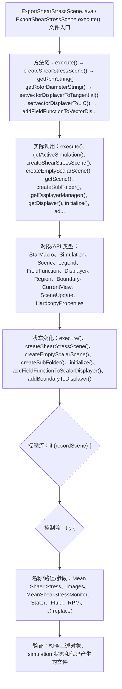

# Case Macro Directory

## Summary

本宏通过在 STAR-CCM+ 中执行 ExportShearStressScene.execute()，并调用 execute(), getActiveSimulation(), createShearStressScene(), createEmptyScalarScene(), getScene(), createSubFolder(), getDisplayerManager(), getDisplayer() 操作 StarMacro、Simulation、Scene、Legend、FieldFunction、Displayer、Region、Boundary，实现将 simulation 中的结果或监视数据整理并导出为可复用文件，解决结果文件和监视数据需要人工整理。

## Input

- 已打开的 STAR-CCM+ simulation，以及代码中通过名称获取的已有对象。
- 代码中引用的对象名称或参数：Mean Shaer Stress、images、MeanShearStressMonitor、Stator、Fluid、RPM、, 、).replace(。运行前需确认模型树中名称一致。

## Output

- 被创建、读取或修改的 STAR-CCM+ 对象：StarMacro、Simulation、Scene、Legend、FieldFunction、Displayer、Region、Boundary。
- 代码执行的结果操作：execute()、createShearStressScene()、createEmptyScalarScene()、createSubFolder()、initialize()、addFieldFunctionToScalarDisplayer()、addBoundaryToDisplayer()。

## Workflow

## Maintenance

- `Code` 只保留属于本功能边界的 Java 文件；如果新增文件不能接入当前执行链，应建立新的功能目录。
- 修改对象名称、输入路径、参数或执行顺序后，必须同步更新本文件的 `Input`、`Output` 和 Mermaid `Workflow`。
