# Case Macro Directory

## Summary

本宏通过在 STAR-CCM+ 中执行 a1continua.execute()，并调用 execute(), execute0(), getActiveSimulation(), getContinuumManager(), getContinuum(), enable(), getModelManager(), getModel() 操作 StarMacro、Simulation、PhysicsContinuum、Liquid、Units、Part、Body、FileTable，实现在 STAR-CCM+ simulation 中执行该功能对应的对象配置和结果处理，解决该类 STAR-CCM+ 模型处理依赖重复手工操作。

## Input

- Input_Files\unsteadyinlet.csv：代码或案例运行所需的输入文件。
- 代码中引用的对象名称或参数：Physics 1、Blood、Pa-s、kg/m^3、Body 1、assign part to region、P:\\Macros\\unsteadyinlet.csv、inlet。运行前需确认模型树中名称一致。

## Output

- 被创建、读取或修改的 STAR-CCM+ 对象：StarMacro、Simulation、PhysicsContinuum、Liquid、Units、Part、Body、FileTable。
- 代码执行的结果操作：execute()、execute0()、enable()、setPresentationName()、setValueAndUnits()、createFromFile()、setBoundaryType()、setTable()、setData()、setSelected()、setInput()、setTransparencyOverrideMode()。

## Workflow

```mermaid
flowchart TD
    F1["a1continua.java / a1continua.execute(): 文件入口"]
    F1 --> F1M["方法链：execute() → execute0()"]
    F1M --> F1A["实际调用：execute(), execute0(), getActiveSimulation(), getContinuumManager(), getContinuum(), enable(), getModelManager(), getModel(), getMaterial(), setPresentationName(), getMater..."]
    F1A --> F1O["对象/API 类型：StarMacro、Simulation、PhysicsContinuum、Liquid、Units"]
    F1O --> F1S["状态变化：execute()、execute0()、enable()、setPresentationName()、setValueAndUnits()"]
    F1S --> F1R["名称/路径/参数：Physics 1、Blood、Pa-s、kg/m^3"]
    F2["a2inletvel.java / a2inletvel.execute(): 文件入口"]
    F1R --> F2
    F2 --> F2M["方法链：execute() → execute0()"]
    F2M --> F2A["实际调用：execute(), execute0(), getActiveSimulation(), getTableManager(), createFromFile(), resolvePath(), getRegionManager(), getRegion(), getBoundaryManager(), getBoundary(), get(..."]
    F2A --> F2O["对象/API 类型：Part、Body、StarMacro、Simulation、FileTable、Region、Boundary"]
    F2O --> F2S["状态变化：execute()、execute0()、createFromFile()、setBoundaryType()、setTable()、setData()、setSelected()"]
    F2S --> F2R["名称/路径/参数：Body 1、assign part to region、P:\\Macros\\unsteadyinlet.csv、inlet、velocity"]
    F3["a3velocityprobe.java / a3velocityprobe.execute(): 文件入口"]
    F2R --> F3
    F3 --> F3M["方法链：execute() → execute0()"]
    F3M --> F3A["实际调用：execute(), execute0(), getActiveSimulation(), getSceneManager(), getScene(), getCurrentView(), setInput(), getUnitsManager(), getPreferredUnits(), Builder(), build(), setTr..."]
    F3A --> F3O["对象/API 类型：StarMacro、Simulation、Scene、CurrentView、Units、Region、Body、Probe、SceneUpdate、HardcopyProperties、Report、Plot"]
    F3O --> F3S["状态变化：execute()、execute0()、setInput()、setTransparencyOverrideMode()、setQuery()、setObjects()"]
    F3S --> F3R["名称/路径/参数：Geometry Scene 1、Body 1、Probe Surface、Velocity、velocity_inlet、%1$s Plot、velocity_inlet Monitor、velocity_inlet Monitor Plot"]
    F4["a4monitors.java / a4monitors.execute(): 文件入口"]
    F3R --> F4
    F4 --> F4M["方法链：execute() → execute0()"]
    F4M --> F4A["实际调用：execute(), execute0(), getActiveSimulation(), getMonitorManager(), create(), setPresentationName(), getParts(), setQuery(), getRegionManager(), getRegion(), getBoundaryMana..."]
    F4A --> F4O["对象/API 类型：StarMacro、Simulation、Region、Body、Boundary"]
    F4O --> F4S["状态变化：execute()、execute0()、create()、setPresentationName()、setQuery()、setObjects()、setFieldFunction()"]
    F4S --> F4R["名称/路径/参数：Mean WSS、Body 1、wall、WallShearStress、Sum WSS、Sum WSS i、Sum WSS j、Sum WSS k"]
    F5["a5fieldfunctions.java / a5fieldfunctions.execute(): 文件入口"]
    F4R --> F5
    F5 --> F5M["方法链：execute() → execute0()"]
    F5M --> F5A["实际调用：execute(), execute0(), getActiveSimulation(), getFieldFunctionManager(), createFieldFunction(), getTypeOption(), setSelected(), setPresentationName(), setFunctionName(), se..."]
    F5A --> F5O["对象/API 类型：StarMacro、Simulation、UserFieldFunction、Units"]
    F5O --> F5S["状态变化：execute()、execute0()、createFieldFunction()、setSelected()、setPresentationName()、setFunctionName()、setDefinition()、setDimensions()"]
    F5S --> F5R["名称/路径/参数：number of samples、n-samples、${Time}/${TimeStep}、OSI、TA-WSS、${SumWSSMonitor}/${n-samples}、RRT、1/((1-2*${OSI})*${TA-WSS})"]
    F6["a6mesheroperations.java / a6mesheroperations.execute(): 文件入口"]
    F5R --> F6
    F6 --> F6M["方法链：execute() → execute0()"]
    F6M --> F6A["实际调用：execute(), execute0(), getActiveSimulation(), get(), getPart(), createAutoMeshOperation(), getUnitsManager(), getObject(), getDefaultValues(), setValueAndUnits()"]
    F6A --> F6O["对象/API 类型：StarMacro、Simulation、Body、AutoMeshOperation、MeshOperationManager、GeometryPart、Units"]
    F6O --> F6S["状态变化：execute()、execute0()、createAutoMeshOperation()、setValueAndUnits()"]
    F6S --> F6R["名称/路径/参数：Body 1"]
    F7["a8views.java / a8views.execute(): 文件入口"]
    F6R --> F7
    F7 --> F7M["方法链：execute() → execute0()"]
    F7M --> F7A["实际调用：execute(), execute0(), getActiveSimulation(), getSceneManager(), getScene(), getCurrentView(), setInput(), resetCamera(), setViewOrientation(), saveCurrentView()"]
    F7A --> F7O["对象/API 类型：StarMacro、Simulation、Scene、CurrentView"]
    F7O --> F7S["状态变化：execute()、execute0()、setInput()、resetCamera()、setViewOrientation()、saveCurrentView()"]
    F7S --> F7R["名称/路径/参数：Geometry Scene 1"]
    F8["a9outlet.java / a9outlet.execute(): 文件入口"]
    F7R --> F8
    F8 --> F8M["方法链：execute() → execute0()"]
    F8M --> F8A["实际调用：execute(), execute0(), getActiveSimulation(), getRegionManager(), getRegion(), getBoundaryManager(), getBoundary(), get(), setBoundaryType(), getValues(), getUnitsManager()..."]
    F8A --> F8O["对象/API 类型：StarMacro、Simulation、Region、Body、Boundary、Units"]
    F8O --> F8S["状态变化：execute()、execute0()、setBoundaryType()、setValueAndUnits()"]
    F8S --> F8R["名称/路径/参数：Body 1、outlet、outlet 2"]
    F9["a10scenes.java / a10scenes.execute(): 文件入口"]
    F8R --> F9
    F9 --> F9M["方法链：execute() → execute0()"]
    F9M --> F9A["实际调用：execute(), execute0(), getActiveSimulation(), getSceneManager(), createScalarScene(), getScene(), initializeAndWait(), getDisplayerManager(), getObject(), getLegend(), get(..."]
    F9A --> F9O["对象/API 类型：StarMacro、Simulation、Scene、Legend、SceneUpdate、HardcopyProperties、CurrentView、Region、Body、Boundary、Units、UserFieldFunction"]
    F9O --> F9S["状态变化：execute()、execute0()、createScalarScene()、initializeAndWait()、setLookupTable()、setCurrentResolutionWidth()、setCurrentResolutionHeight()、resetCamera()"]
    F9S --> F9R["名称/路径/参数：Scalar Scene、Outline、Scalar、Scalar Scene 2、Scalar 1、blue-yellow-red、Geometry Scene 1、Scalar Scene 3"]
    F9R --> OUT["验证：检查上述对象、simulation 状态和代码产生的文件"]
```

## Maintenance

- `Code` 只保留属于本功能边界的 Java 文件；如果新增文件不能接入当前执行链，应建立新的功能目录。
- 修改对象名称、输入路径、参数或执行顺序后，必须同步更新本文件的 `Input`、`Output` 和 Mermaid `Workflow`。
