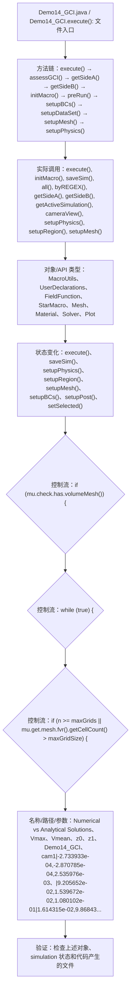

# Case Macro Directory

## Summary

本宏通过在 STAR-CCM+ 中执行 Demo14_GCI.execute()，并调用 execute(), initMacro(), saveSim(), all(), byREGEX(), getSideA(), getSideB(), getActiveSimulation() 操作 MacroUtils、UserDeclarations、FieldFunction、StarMacro、Mesh、Material、Solver、Plot，实现按案例参数组织几何、物理、网格、求解和后处理步骤，解决该类 STAR-CCM+ 模型处理依赖重复手工操作。

## Input

- 已打开的 STAR-CCM+ simulation，以及代码中通过名称获取的已有对象。
- 代码中引用的对象名称或参数：Numerical vs Analytical Solutions、Vmax、Vmean、z0、z1、Demo14_GCI、cam1|-2.733933e-04,-2.870785e-04,2.535976e-03、|9.205652e-02,1.539672e-02,1.080102e-01|1.614315e-02,9.868431e-01,-1.608729e-01。运行前需确认模型树中名称一致。

## Output

- 被创建、读取或修改的 STAR-CCM+ 对象：MacroUtils、UserDeclarations、FieldFunction、StarMacro、Mesh、Material、Solver、Plot。
- 代码执行的结果操作：execute()、saveSim()、setupPhysics()、setupRegion()、setupMesh()、setupBCs()、setupPost()、setSelected()。

## Workflow

## Maintenance

- `Code` 只保留属于本功能边界的 Java 文件；如果新增文件不能接入当前执行链，应建立新的功能目录。
- 修改对象名称、输入路径、参数或执行顺序后，必须同步更新本文件的 `Input`、`Output` 和 Mermaid `Workflow`。
