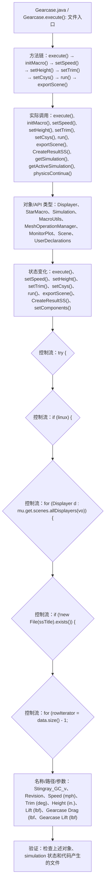

# Case Macro Directory

## Summary

本宏通过在 STAR-CCM+ 中执行 Gearcase.execute()，并调用 execute(), initMacro(), setSpeed(), setHeight(), setTrim(), setCsys(), run(), exportScene() 操作 Displayer、StarMacro、Simulation、MacroUtils、MeshOperationManager、MonitorPlot、Scene、UserDeclarations，实现按案例参数组织几何、物理、网格、求解和后处理步骤，解决该类 STAR-CCM+ 模型处理依赖重复手工操作。

## Input

- 已打开的 STAR-CCM+ simulation，以及代码中通过名称获取的已有对象。
- 代码中引用的对象名称或参数：Stingray_GC_v、Revision、Speed (mph)、Trim (deg)、Height (in.)、Lift (lbf)、Gearcase Drag (lbf、Gearcase Lift (lbf)。运行前需确认模型树中名称一致。

## Output

- 被创建、读取或修改的 STAR-CCM+ 对象：Displayer、StarMacro、Simulation、MacroUtils、MeshOperationManager、MonitorPlot、Scene、UserDeclarations。
- 代码执行的结果操作：execute()、setSpeed()、setHeight()、setTrim()、setCsys()、run()、exportScene()、CreateResultSS()、setComponents()。

## Workflow

## Maintenance

- `Code` 只保留属于本功能边界的 Java 文件；如果新增文件不能接入当前执行链，应建立新的功能目录。
- 修改对象名称、输入路径、参数或执行顺序后，必须同步更新本文件的 `Input`、`Output` 和 Mermaid `Workflow`。
