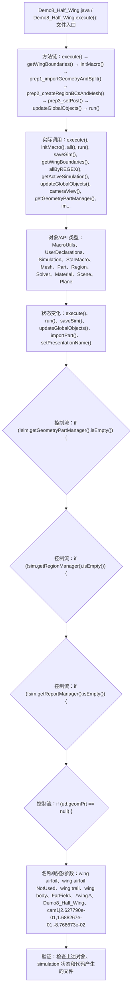

# Case Macro Directory

## Summary

本宏通过在 STAR-CCM+ 中执行 Demo8_Half_Wing.execute()，并调用 execute(), initMacro(), all(), run(), saveSim(), getWingBoundaries(), allByREGEX(), getActiveSimulation() 操作 MacroUtils、UserDeclarations、Simulation、StarMacro、Mesh、Part、Region、Solver，实现按案例参数组织几何、物理、网格、求解和后处理步骤，解决该类 STAR-CCM+ 模型处理依赖重复手工操作。

## Input

- 已打开的 STAR-CCM+ simulation，以及代码中通过名称获取的已有对象。
- 代码中引用的对象名称或参数：wing airfoil、wing airfoil NotUsed、wing trail、wing body、FarField、.*wing.*、Demo8_Half_Wing、cam1|2.627790e-01,1.688267e-01,-8.768673e-02。运行前需确认模型树中名称一致。

## Output

- 被创建、读取或修改的 STAR-CCM+ 对象：MacroUtils、UserDeclarations、Simulation、StarMacro、Mesh、Part、Region、Solver。
- 代码执行的结果操作：execute()、run()、saveSim()、updateGlobalObjects()、importPart()、setPresentationName()。

## Workflow

## Maintenance

- `Code` 只保留属于本功能边界的 Java 文件；如果新增文件不能接入当前执行链，应建立新的功能目录。
- 修改对象名称、输入路径、参数或执行顺序后，必须同步更新本文件的 `Input`、`Output` 和 Mermaid `Workflow`。
