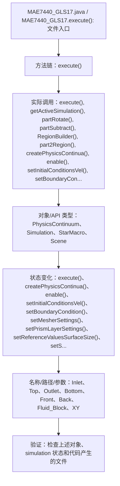

# Case Macro Directory

## Summary

本宏通过在 STAR-CCM+ 中执行 MAE7440_GLS17.execute()，并调用 execute(), getActiveSimulation(), partRotate(), partSubtract(), RegionBuilder(), part2Region(), createPhysicsContinua(), enable() 操作 PhysicsContinuum、Simulation、StarMacro、Scene，实现按案例参数组织几何、物理、网格、求解和后处理步骤，解决该类 STAR-CCM+ 模型处理依赖重复手工操作。

## Input

- 已打开的 STAR-CCM+ simulation，以及代码中通过名称获取的已有对象。
- 代码中引用的对象名称或参数：Inlet、Top、Outlet、Bottom、Front、Back、Fluid_Block、XY。运行前需确认模型树中名称一致。

## Output

- 被创建、读取或修改的 STAR-CCM+ 对象：PhysicsContinuum、Simulation、StarMacro、Scene。
- 代码执行的结果操作：execute()、createPhysicsContinua()、enable()、setInitialConditionsVel()、setBoundaryCondition()、setMesherSettings()、setPrismLayerSettings()、setReferenceValuesSurfaceSize()、setSurfaceGrowthRate()、setCustomBoundarySurfaceSize()、generateMesh()、setKepsilonRelax()。

## Workflow

## Maintenance

- `Code` 只保留属于本功能边界的 Java 文件；如果新增文件不能接入当前执行链，应建立新的功能目录。
- 修改对象名称、输入路径、参数或执行顺序后，必须同步更新本文件的 `Input`、`Output` 和 Mermaid `Workflow`。
