# Case Macro Directory

## Summary

本宏通过在 STAR-CCM+ 中执行 make_plane_sweep.execute()，并调用 execute(), execute0(), getActiveSimulation(), getPartManager(), getObjects(), getPresentationName(), createImplicitPart(), setPresentationName() 操作 StarMacro、Simulation、Part、Region、Report、Units，实现在 STAR-CCM+ simulation 中执行该功能对应的对象配置和结果处理，解决该类 STAR-CCM+ 模型处理依赖重复手工操作。

## Input

- 已打开的 STAR-CCM+ simulation，以及代码中通过名称获取的已有对象。
- 代码中引用的对象名称或参数：coolant、xu [coolant/plate]、HTC-tb-Star.out、HTC-tb-Star.csv、calc-slice、calc-slice plane exists、calc-point、calc-point point exists。运行前需确认模型树中名称一致。

## Output

- 被创建、读取或修改的 STAR-CCM+ 对象：StarMacro、Simulation、Part、Region、Report、Units。
- 代码执行的结果操作：execute()、execute0()、createImplicitPart()、setPresentationName()、createPointPart()、setObjects()、createReport()。

## Workflow

```mermaid
flowchart TD
    F1["make_Tbulk_sweep.java / make_plane_sweep.execute(): 文件入口"]
    F1 --> F1M["方法链：execute() → execute0()"]
    F1M --> F1A["实际调用：execute(), execute0(), getActiveSimulation(), getPartManager(), getObjects(), getPresentationName(), createImplicitPart(), setPresentationName(), getObject(), getRegionMana..."]
    F1A --> F1O["对象/API 类型：StarMacro、Simulation、Part、Region、Report、Units"]
    F1O --> F1S["状态变化：execute()、execute0()、createImplicitPart()、setPresentationName()、createPointPart()、setObjects()、createReport()"]
    F1S --> F1C170428023{"控制流：if(csv_flag == false)"}
    F1C170428023 --> F1C375132981{"控制流：for (Part part : myParts) {"}
    F1C375132981 --> F1C631431269{"控制流：if (partName.equals('calc-slice')){"}
    F1C631431269 --> F1C1072675826{"控制流：if (partName.equals('calc-point')){"}
    F1C1072675826 --> F1C1874377441{"控制流：if (calcSlice == false){"}
    F1C1874377441 --> F1R["名称/路径/参数：coolant、xu [coolant/plate]、HTC-tb-Star.out、HTC-tb-Star.csv、calc-slice、calc-slice plane exists、calc-point、calc-point point exists"]
    F1R --> OUT["验证：检查上述对象、simulation 状态和代码产生的文件"]
```

## Maintenance

- `Code` 只保留属于本功能边界的 Java 文件；如果新增文件不能接入当前执行链，应建立新的功能目录。
- 修改对象名称、输入路径、参数或执行顺序后，必须同步更新本文件的 `Input`、`Output` 和 Mermaid `Workflow`。
