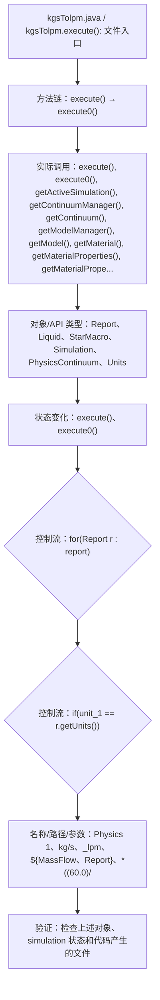

# Case Macro Directory

## Summary

本宏通过在 STAR-CCM+ 中执行 kgsTolpm.execute()，并调用 execute(), execute0(), getActiveSimulation(), getContinuumManager(), getContinuum(), getModelManager(), getModel(), getMaterial() 操作 Report、Liquid、StarMacro、Simulation、PhysicsContinuum、Units，实现读取或转换外部数据并写入 simulation 设置，解决该类 STAR-CCM+ 模型处理依赖重复手工操作。

## Input

- 已打开的 STAR-CCM+ simulation，以及代码中通过名称获取的已有对象。
- 代码中引用的对象名称或参数：Physics 1、kg/s、_lpm、${MassFlow、Report}、*((60.0)/。运行前需确认模型树中名称一致。

## Output

- 被创建、读取或修改的 STAR-CCM+ 对象：Report、Liquid、StarMacro、Simulation、PhysicsContinuum、Units。
- 代码执行的结果操作：execute()、execute0()。

## Workflow

## Maintenance

- `Code` 只保留属于本功能边界的 Java 文件；如果新增文件不能接入当前执行链，应建立新的功能目录。
- 修改对象名称、输入路径、参数或执行顺序后，必须同步更新本文件的 `Input`、`Output` 和 Mermaid `Workflow`。
