# Case Macro Directory

## Summary

本宏通过在 STAR-CCM+ 中执行 meshQualityCheck.execute()，并调用 execute(), getActiveSimulation(), determineIfSolids(), closeScenes(), deleteOldSession(), determineCellQualityRemediation(), enableCellQualityRemediation(), getPartManager() 操作 StarMacro、Simulation、PhysicsContinuum、Report、Region、Part、Mesh、Scene，实现配置并执行几何或网格处理流程，解决网格流程依赖重复的界面操作且容易漏设。

## Input

- 已打开的 STAR-CCM+ simulation，以及代码中通过名称获取的已有对象。
- 代码中引用的对象名称或参数：\n、Bad cell metrics are not available in this version.、Cell quality remediation cannot be enabled, bad cell metrics will be disabled、cellQualityParts、cellQualityReports、cellQualityScenes、cellQualityPlots、meshScenes。运行前需确认模型树中名称一致。

## Output

- 被创建、读取或修改的 STAR-CCM+ 对象：StarMacro、Simulation、PhysicsContinuum、Report、Region、Part、Mesh、Scene。
- 代码执行的结果操作：execute()、closeScenes()、deleteOldSession()、enableCellQualityRemediation()、createGroup()、add()、createCellQualityMetric()、createSkewnessMetric()。

## Workflow

```mermaid
flowchart TD
    F1["meshQualityCheck.java / meshQualityCheck.execute(): 文件入口"]
    F1 --> F1M["方法链：execute() → determineIfSolids() → deleteOldSession() → deletePart() → deleteReport() → deletePlot() → deleteScene() → getCellCount() → createCellQualityMetric() → createSkew..."]
    F1M --> F1A["实际调用：execute(), getActiveSimulation(), determineIfSolids(), closeScenes(), deleteOldSession(), determineCellQualityRemediation(), enableCellQualityRemediation(), getPartManager(..."]
    F1A --> F1O["对象/API 类型：StarMacro、Simulation、PhysicsContinuum、Report、Region、Part、Mesh、Scene、Units、Boundary、Continuum、Legend"]
    F1O --> F1S["状态变化：execute()、closeScenes()、deleteOldSession()、enableCellQualityRemediation()、createGroup()、add()、createCellQualityMetric()、createSkewnessMetric()"]
    F1S --> F1C848191611{"控制流：if (version <= 806) {"}
    F1C848191611 --> F1C329542274{"控制流：if (doBadCellIndicator && version > 806) {"}
    F1C329542274 --> F1C1773185267{"控制流：try {"}
    F1C1773185267 --> F1C113509897{"控制流：if (doMeshScenes) {"}
    F1C113509897 --> F1C1208299611{"控制流：if (solids) {"}
    F1C1208299611 --> F1R["名称/路径/参数：\n、Bad cell metrics are not available in this version.、Cell quality remediation cannot be enabled, bad cell metrics will be disabled、cellQualityParts、cellQualityReports..."]
    F1R --> OUT["验证：检查上述对象、simulation 状态和代码产生的文件"]
```

## Maintenance

- `Code` 只保留属于本功能边界的 Java 文件；如果新增文件不能接入当前执行链，应建立新的功能目录。
- 修改对象名称、输入路径、参数或执行顺序后，必须同步更新本文件的 `Input`、`Output` 和 Mermaid `Workflow`。
