# Case Macro Directory

## Summary

本宏通过在 STAR-CCM+ 中执行 PhiStudy.execute()，并调用 execute(), getActiveSimulation(), getSessionDir(), StartRstReactiveSimulation(), getFileName(), getRotorDiameterString(), getRpmString(), saveAs() 操作 Simulation、StarMacro、Units、Mesh、FieldFunction、Region、Boundary、Plot，实现按案例参数组织几何、物理、网格、求解和后处理步骤，解决该类 STAR-CCM+ 模型处理依赖重复手工操作。

## Input

- 已打开的 STAR-CCM+ simulation，以及代码中通过名称获取的已有对象。
- 代码中引用的对象名称或参数：mSO4_2-、mNa_1+、mBa_2+、mCl_1-、BariteScale、RANS-RST、RANS-kOmega、LES。运行前需确认模型树中名称一致。

## Output

- 被创建、读取或修改的 STAR-CCM+ 对象：Simulation、StarMacro、Units、Mesh、FieldFunction、Region、Boundary、Plot。
- 代码执行的结果操作：execute()、StartRstReactiveSimulation()、saveAs()、saveState()、setTimeStep()、EnableAdaptiveTimeStepping()、enableSecondOrderTimestep()、setInnerIterationCount()。

## Workflow

```mermaid
flowchart TD
    F1["PhiStudy.java / PhiStudy.execute(): 文件入口"]
    F1 --> F1M["方法链：execute() → getFileName() → saveAs() → getRpmString() → getRotorDiameterString() → StartRstReactiveSimulation() → enableReaction() → RecordOutletConcentrations() → recordAnd..."]
    F1M --> F1A["实际调用：execute(), getActiveSimulation(), getSessionDir(), StartRstReactiveSimulation(), getFileName(), getRotorDiameterString(), getRpmString(), saveAs(), saveState(), get(), getO..."]
    F1A --> F1O["对象/API 类型：Simulation、StarMacro、Units、Mesh、FieldFunction、Region、Boundary、Plot、Monitor、MonitorPlot、ReportManager、Report"]
    F1O --> F1S["状态变化：execute()、StartRstReactiveSimulation()、saveAs()、saveState()、setTimeStep()、EnableAdaptiveTimeStepping()、enableSecondOrderTimestep()、setInnerIterationCount()"]
    F1S --> F1C1773185267{"控制流：try {"}
    F1C1773185267 --> F1C1812428458{"控制流：if (isReactive) {"}
    F1C1812428458 --> F1C410447134{"控制流：for (Monitor monitor : monitors) {"}
    F1C410447134 --> F1C160079793{"控制流：if (IsSteady) {"}
    F1C160079793 --> F1C1983709047{"控制流：if (TurbulenceModel == 'RANS-kOmega') {"}
    F1C1983709047 --> F1R["名称/路径/参数：mSO4_2-、mNa_1+、mBa_2+、mCl_1-、BariteScale、RANS-RST、RANS-kOmega、LES"]
    F1R --> OUT["验证：检查上述对象、simulation 状态和代码产生的文件"]
```

## Maintenance

- `Code` 只保留属于本功能边界的 Java 文件；如果新增文件不能接入当前执行链，应建立新的功能目录。
- 修改对象名称、输入路径、参数或执行顺序后，必须同步更新本文件的 `Input`、`Output` 和 Mermaid `Workflow`。
