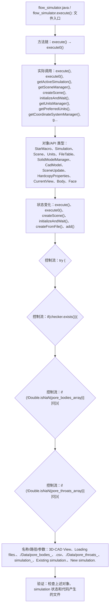

# Case Macro Directory

## Summary

本宏通过在 STAR-CCM+ 中执行 flow_simulator.execute()，并调用 execute(), execute0(), getActiveSimulation(), getSceneManager(), createScene(), initializeAndWait(), getUnitsManager(), getPreferredUnits() 操作 StarMacro、Simulation、Scene、Units、FileTable、SolidModelManager、CadModel、SceneUpdate，实现在 STAR-CCM+ simulation 中执行该功能对应的对象配置和结果处理，解决该类 STAR-CCM+ 模型处理依赖重复手工操作。

## Input

- Input_Files\pore_bodies_1.csv：代码或案例运行所需的输入文件。
- Input_Files\pore_throats_1.csv：代码或案例运行所需的输入文件。
- Input_Files\Star.sim：代码或案例运行所需的输入文件。
- 代码中引用的对象名称或参数：3D-CAD View、Loading files.、./Data/pore_bodies_、.csv、./Data/pore_throats_、simulation_、Existing simulation.、New simulation.。运行前需确认模型树中名称一致。

## Output

- 被创建、读取或修改的 STAR-CCM+ 对象：StarMacro、Simulation、Scene、Units、FileTable、SolidModelManager、CadModel、SceneUpdate。
- 代码执行的结果操作：execute()、execute0()、createScene()、initializeAndWait()、createFromFile()、add()。

## Workflow

## Maintenance

- `Code` 只保留属于本功能边界的 Java 文件；如果新增文件不能接入当前执行链，应建立新的功能目录。
- 修改对象名称、输入路径、参数或执行顺序后，必须同步更新本文件的 `Input`、`Output` 和 Mermaid `Workflow`。
