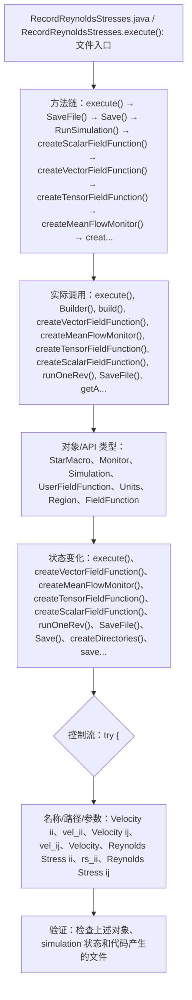

# Case Macro Directory

## Summary

本宏通过在 STAR-CCM+ 中执行 RecordReynoldsStresses.execute()，并调用 execute(), Builder(), build(), createVectorFieldFunction(), createMeanFlowMonitor(), createTensorFieldFunction(), createScalarFieldFunction(), runOneRev() 操作 StarMacro、Monitor、Simulation、UserFieldFunction、Units、Region、FieldFunction，实现建立并保存用于监测或后处理的历史数据，解决监测历史和后处理数据准备过程容易不一致。

## Input

- 已打开的 STAR-CCM+ simulation，以及代码中通过名称获取的已有对象。
- 代码中引用的对象名称或参数：Velocity ii、vel_ii、Velocity ij、vel_ij、Velocity、Reynolds Stress ii、rs_ii、Reynolds Stress ij。运行前需确认模型树中名称一致。

## Output

- 被创建、读取或修改的 STAR-CCM+ 对象：StarMacro、Monitor、Simulation、UserFieldFunction、Units、Region、FieldFunction。
- 代码执行的结果操作：execute()、createVectorFieldFunction()、createMeanFlowMonitor()、createTensorFieldFunction()、createScalarFieldFunction()、runOneRev()、SaveFile()、Save()、createDirectories()、saveState()、RunSimulation()、run()。

## Workflow

## Maintenance

- `Code` 只保留属于本功能边界的 Java 文件；如果新增文件不能接入当前执行链，应建立新的功能目录。
- 修改对象名称、输入路径、参数或执行顺序后，必须同步更新本文件的 `Input`、`Output` 和 Mermaid `Workflow`。
