# Case Macro Directory

## Summary

本宏通过在 STAR-CCM+ 中执行 Demo15_Run_DES.execute()，并调用 execute(), initMacro(), runRANS(), runDES(), saveSim(), all(), getPresentationName(), setDisplayMeshBoolean() 操作 MacroUtils、UserDeclarations、Monitor、StarMacro、LookupTable、Scene、Mesh、Displayer，实现按预设参数推进 simulation 的网格、初始化和求解过程，解决已有模型无法按固定顺序重复运行并保存结果。

## Input

- 已打开的 STAR-CCM+ simulation，以及代码中通过名称获取的已有对象。
- 代码中引用的对象名称或参数：Polys And Prisms、Fixing Scalar Displayer for Scene: 、Scalar.*、Demo15_Run_DES、cam1|5.530468e-02,-1.190976e-02,-7.199782e-02、|4.282329e-01,2.739476e-01,5.776558e-01|-1.501948e-01,9.338231e-01,-3.246781e-01、|8.359997e-02|1、cam2|1.841383e-02,2.223453e-02,-3.292230e-05。运行前需确认模型树中名称一致。

## Output

- 被创建、读取或修改的 STAR-CCM+ 对象：MacroUtils、UserDeclarations、Monitor、StarMacro、LookupTable、Scene、Mesh、Displayer。
- 代码执行的结果操作：execute()、runRANS()、runDES()、saveSim()、setDisplayMeshBoolean()、setLabelFormat()、setLookupTable()、setNumberOfLabels()、setAutoRange()、setRange()、setWidth()、setPositionCoordinate()。

## Workflow

```mermaid
flowchart TD
    F1["Demo15_Run_DES.java / Demo15_Run_DES.execute(): 文件入口"]
    F1 --> F1M["方法链：execute() → fixScalarDisplayer() → initMacro() → runDES() → runRANS() → setupPartDisplayer() → setupPostDES() → setupPostRANS() → setupPreDES() → setupPreRANS()"]
    F1M --> F1A["实际调用：execute(), initMacro(), runRANS(), runDES(), saveSim(), all(), getPresentationName(), setDisplayMeshBoolean(), getLegend(), setLabelFormat(), setLookupTable(), setNumberOfL..."]
    F1A --> F1O["对象/API 类型：MacroUtils、UserDeclarations、Monitor、StarMacro、LookupTable、Scene、Mesh、Displayer、Plane、Probe、Material、Solver"]
    F1O --> F1S["状态变化：execute()、runRANS()、runDES()、saveSim()、setDisplayMeshBoolean()、setLabelFormat()、setLookupTable()、setNumberOfLabels()、setAutoRange()、setRange()、setWidth()、setPositionCoordin..."]
    F1S --> F1C438404506{"控制流：if (range != null) {"}
    F1C438404506 --> F1C82244776{"控制流：if (i == 1) {"}
    F1C82244776 --> F1C284351465{"控制流：if (w > 0.) {"}
    F1C284351465 --> F1C2107503585{"控制流：if (mu.check.has.volumeMesh()) {"}
    F1C2107503585 --> F1C1575065092{"控制流：if (mu.get.mesh.baseSize(ud.mshOp, true).getRawValue() <= 2.0) {"}
    F1C1575065092 --> F1R["名称/路径/参数：Polys And Prisms、Fixing Scalar Displayer for Scene: 、Scalar.*、Demo15_Run_DES、cam1|5.530468e-02,-1.190976e-02,-7.199782e-02、|4.282329e-01,2.739476e-01,5.776558e-01|-1.50..."]
    F1R --> OUT["验证：检查上述对象、simulation 状态和代码产生的文件"]
```

## Maintenance

- `Code` 只保留属于本功能边界的 Java 文件；如果新增文件不能接入当前执行链，应建立新的功能目录。
- 修改对象名称、输入路径、参数或执行顺序后，必须同步更新本文件的 `Input`、`Output` 和 Mermaid `Workflow`。
