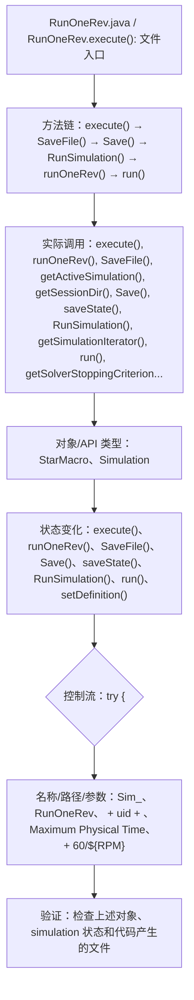

# Case Macro Directory

## Summary

本宏通过在 STAR-CCM+ 中执行 RunOneRev.execute()，并调用 execute(), runOneRev(), SaveFile(), getActiveSimulation(), getSessionDir(), Save(), saveState(), RunSimulation() 操作 StarMacro、Simulation，实现按预设参数推进 simulation 的网格、初始化和求解过程，解决已有模型无法按固定顺序重复运行并保存结果。

## Input

- 已打开的 STAR-CCM+ simulation，以及代码中通过名称获取的已有对象。
- 代码中引用的对象名称或参数：Sim_、RunOneRev、 + uid + 、Maximum Physical Time、 + 60/${RPM}。运行前需确认模型树中名称一致。

## Output

- 被创建、读取或修改的 STAR-CCM+ 对象：StarMacro、Simulation。
- 代码执行的结果操作：execute()、runOneRev()、SaveFile()、Save()、saveState()、RunSimulation()、run()、setDefinition()。

## Workflow

## Maintenance

- `Code` 只保留属于本功能边界的 Java 文件；如果新增文件不能接入当前执行链，应建立新的功能目录。
- 修改对象名称、输入路径、参数或执行顺序后，必须同步更新本文件的 `Input`、`Output` 和 Mermaid `Workflow`。
