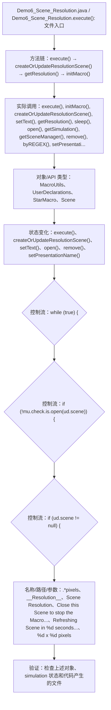

# Case Macro Directory

## Summary

本宏通过在 STAR-CCM+ 中执行 Demo6_Scene_Resolution.execute()，并调用 execute(), initMacro(), createOrUpdateResolutionScene(), setText(), getResolution(), sleep(), open(), getSimulation() 操作 MacroUtils、UserDeclarations、StarMacro、Scene，实现配置场景、视图和可视化对象以生成可检查的结果，解决场景显示和可视化输出依赖重复手工设置。

## Input

- 已打开的 STAR-CCM+ simulation，以及代码中通过名称获取的已有对象。
- 代码中引用的对象名称或参数：.*pixels、__Resolution__、Scene Resolution、Close this Scene to stop the Macro...、Refreshing Scene in %d seconds...、%d x %d pixels。运行前需确认模型树中名称一致。

## Output

- 被创建、读取或修改的 STAR-CCM+ 对象：MacroUtils、UserDeclarations、StarMacro、Scene。
- 代码执行的结果操作：execute()、createOrUpdateResolutionScene()、setText()、open()、remove()、setPresentationName()。

## Workflow

## Maintenance

- `Code` 只保留属于本功能边界的 Java 文件；如果新增文件不能接入当前执行链，应建立新的功能目录。
- 修改对象名称、输入路径、参数或执行顺序后，必须同步更新本文件的 `Input`、`Output` 和 Mermaid `Workflow`。
