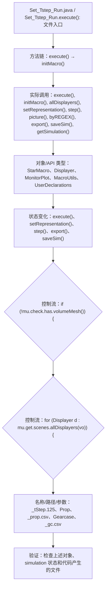

# Case Macro Directory

## Summary

本宏通过在 STAR-CCM+ 中执行 Set_Tstep_Run.execute()，并调用 execute(), initMacro(), allDisplayers(), setRepresentation(), step(), picture(), byREGEX(), export() 操作 StarMacro、Displayer、MonitorPlot、MacroUtils、UserDeclarations，实现配置 simulation 的物理模型、边界条件或求解参数，解决物理模型、边界或求解参数容易配置不一致。

## Input

- 已打开的 STAR-CCM+ simulation，以及代码中通过名称获取的已有对象。
- 代码中引用的对象名称或参数：_tStep.125、Prop、_prop.csv、Gearcase、_gc.csv。运行前需确认模型树中名称一致。

## Output

- 被创建、读取或修改的 STAR-CCM+ 对象：StarMacro、Displayer、MonitorPlot、MacroUtils、UserDeclarations。
- 代码执行的结果操作：execute()、setRepresentation()、step()、export()、saveSim()。

## Workflow

## Maintenance

- `Code` 只保留属于本功能边界的 Java 文件；如果新增文件不能接入当前执行链，应建立新的功能目录。
- 修改对象名称、输入路径、参数或执行顺序后，必须同步更新本文件的 `Input`、`Output` 和 Mermaid `Workflow`。
