# Case Macro Directory

## Summary

本宏通过在 STAR-CCM+ 中执行 Simulate.execute()，并调用 execute(), SetAutoSave(), Save(), RunSteps(), setTimeStep(), EnableSpecies(), createEtcFieldFuncs(), addIsoThermal() 操作 StarMacro、Units、Mesh、Simulation、PhysicsContinuum、AutoMeshOperation、MeshOperationManager、Region，实现按预设参数推进 simulation 的网格、初始化和求解过程，解决已有模型无法按固定顺序重复运行并保存结果。

## Input

- 已打开的 STAR-CCM+ simulation，以及代码中通过名称获取的已有对象。
- 代码中引用的对象名称或参数：RANS-kOmega、LES、Laminar、Cubic、Linear、QCR、Sim_、 + UUID.randomUUID().toString() + 。运行前需确认模型树中名称一致。

## Output

- 被创建、读取或修改的 STAR-CCM+ 对象：StarMacro、Units、Mesh、Simulation、PhysicsContinuum、AutoMeshOperation、MeshOperationManager、Region。
- 代码执行的结果操作：execute()、SetAutoSave()、Save()、RunSteps()、setTimeStep()、EnableSpecies()、createEtcFieldFuncs()、addIsoThermal()、AddUserLib()、AddSaturationScene()、RunSimulation()、createDirectories()。

## Workflow

```mermaid
flowchart TD
    F1["Simulate.java / Simulate.execute(): 文件入口"]
    F1 --> F1M["方法链：execute() → Save() → EnableSpecies() → RunSteps() → RunSimulation() → SetAutoSave() → SetTransientStoppingCriteria() → CreatePhysics() → SetPrismLayers() → CreateAutomatedMe..."]
    F1M --> F1A["实际调用：execute(), SetAutoSave(), Save(), RunSteps(), setTimeStep(), EnableSpecies(), createEtcFieldFuncs(), addIsoThermal(), AddUserLib(), AddSaturationScene(), RunSimulation(), g..."]
    F1A --> F1O["对象/API 类型：StarMacro、Units、Mesh、Simulation、PhysicsContinuum、AutoMeshOperation、MeshOperationManager、Region、Boundary、Plane、UserFieldFunction、MonitorPlot"]
    F1O --> F1S["状态变化：execute()、SetAutoSave()、Save()、RunSteps()、setTimeStep()、EnableSpecies()、createEtcFieldFuncs()、addIsoThermal()、AddUserLib()、AddSaturationScene()、RunSimulation()、createDirect..."]
    F1S --> F1C2143852836{"控制流：if (enableSpecies) {"}
    F1C2143852836 --> F1C2027012659{"控制流：if (enableSaturationEq) {"}
    F1C2027012659 --> F1C1773185267{"控制流：try {"}
    F1C1773185267 --> F1C160079793{"控制流：if (IsSteady) {"}
    F1C160079793 --> F1C192223651{"控制流：if (isSteady) {"}
    F1C192223651 --> F1R["名称/路径/参数：RANS-kOmega、LES、Laminar、Cubic、Linear、QCR、Sim_、 + UUID.randomUUID().toString() +"]
    F1R --> OUT["验证：检查上述对象、simulation 状态和代码产生的文件"]
```

## Maintenance

- `Code` 只保留属于本功能边界的 Java 文件；如果新增文件不能接入当前执行链，应建立新的功能目录。
- 修改对象名称、输入路径、参数或执行顺序后，必须同步更新本文件的 `Input`、`Output` 和 Mermaid `Workflow`。
