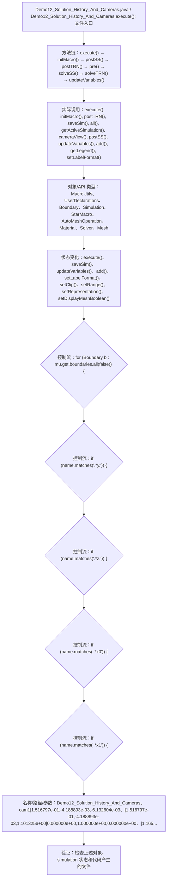

# Case Macro Directory

## Summary

本宏通过在 STAR-CCM+ 中执行 Demo12_Solution_History_And_Cameras.execute()，并调用 execute(), initMacro(), postTRN(), saveSim(), all(), getActiveSimulation(), cameraView(), postSS() 操作 MacroUtils、UserDeclarations、Boundary、Simulation、StarMacro、AutoMeshOperation、Material、Solver，实现建立并保存用于监测或后处理的历史数据，解决监测历史和后处理数据准备过程容易不一致。

## Input

- 已打开的 STAR-CCM+ simulation，以及代码中通过名称获取的已有对象。
- 代码中引用的对象名称或参数：Demo12_Solution_History_And_Cameras、cam1|1.516797e-01,-4.188893e-03,-6.132604e-03、|1.516797e-01,-4.188893e-03,1.101325e+00|0.000000e+00,1.000000e+00,0.000000e+00、|1.165985e-01|1、cam2|5.502414e-02,3.902467e-04,-1.586686e-04、|5.502414e-02,3.902467e-04,1.101325e+00|0.000000e+00,1.000000e+00,0.000000e+00、|4.309526e-02|1、cam3|3.000000e-01,3.902467e-04,-1.586686e-04。运行前需确认模型树中名称一致。

## Output

- 被创建、读取或修改的 STAR-CCM+ 对象：MacroUtils、UserDeclarations、Boundary、Simulation、StarMacro、AutoMeshOperation、Material、Solver。
- 代码执行的结果操作：execute()、saveSim()、updateVariables()、add()、setLabelFormat()、setClip()、setRange()、setRepresentation()、setDisplayMeshBoolean()。

## Workflow

## Maintenance

- `Code` 只保留属于本功能边界的 Java 文件；如果新增文件不能接入当前执行链，应建立新的功能目录。
- 修改对象名称、输入路径、参数或执行顺序后，必须同步更新本文件的 `Input`、`Output` 和 Mermaid `Workflow`。
