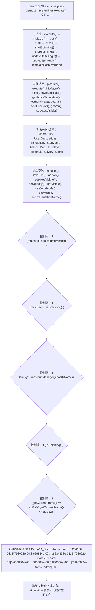

# Case Macro Directory

## Summary

本宏通过在 STAR-CCM+ 中执行 Demo13_Streamlines.execute()，并调用 pictures(), execute(), initMacro(), post(), saveSim(), all(), getActiveSimulation(), cameraView() 操作 MacroUtils、UserDeclarations、Simulation、StarMacro、Mesh、Part、Displayer、Material，实现配置场景、视图和可视化对象以生成可检查的结果，解决场景显示和可视化输出依赖重复手工设置。

## Input

- 已打开的 STAR-CCM+ simulation，以及代码中通过名称获取的已有对象。
- 代码中引用的对象名称或参数：Demo13_Streamlines、cam1|2.234138e-03,-5.793002e-04,3.969814e-02、|2.234138e-03,-5.793002e-04,3.269352e-01|0.000000e+00,1.000000e+00,0.000000e+00、|7.498392e-02|0、cam2|2.873504e-04,3.784037e-03,3.752940e-02、|2.873504e-04,3.784037e-03,2.115639e-01|0.000000e+00,1.000000e+00,0.000000e+00、|4.543212e-02|0、Scalar。运行前需确认模型树中名称一致。

## Output

- 被创建、读取或修改的 STAR-CCM+ 对象：MacroUtils、UserDeclarations、Simulation、StarMacro、Mesh、Part、Displayer、Material。
- 代码执行的结果操作：execute()、saveSim()、addAll()、setAxesVisible()、setOpacity()、setVisible()、setColorMode()、setMesh()、setPresentationName()。

## Workflow

## Maintenance

- `Code` 只保留属于本功能边界的 Java 文件；如果新增文件不能接入当前执行链，应建立新的功能目录。
- 修改对象名称、输入路径、参数或执行顺序后，必须同步更新本文件的 `Input`、`Output` 和 Mermaid `Workflow`。
