# Case Macro Directory

## Summary

本宏通过在 STAR-CCM+ 中执行 SummaryWriter.execute()，并调用 SummaryWriter(), getSimulation(), getPresentationName(), clear(), addAll(), all(), getPartInfo(), getMonitorManager() 操作 MacroUtils、Monitor、Boundary、FvRepresentation、GeometryPart、Region、Simulation、Units，实现将 simulation 中的结果或监视数据整理并导出为可复用文件，解决该类 STAR-CCM+ 模型处理依赖重复手工操作。

## Input

- 已打开的 STAR-CCM+ simulation，以及代码中通过名称获取的已有对象。
- 代码中引用的对象名称或参数：Summary_、.ref、Geometry、Mesh、Monitors、Plots、Regions、Reports。运行前需确认模型树中名称一致。

## Output

- 被创建、读取或修改的 STAR-CCM+ 对象：MacroUtils、Monitor、Boundary、FvRepresentation、GeometryPart、Region、Simulation、Units。
- 代码执行的结果操作：clear()、addAll()。

## Workflow

```mermaid
flowchart TD
    F1["SummaryWriter.java / SummaryWriter.execute(): 文件入口"]
    F1 --> F1M["方法链：execute() → SummaryWriter() → collectGeometry() → collectMesh() → collectMonitors() → collectPlot() → collectPlots() → collectRegions() → collectReports() → collectScenes()"]
    F1M --> F1A["实际调用：SummaryWriter(), getSimulation(), getPresentationName(), clear(), addAll(), all(), getPartInfo(), getMonitorManager(), getMonitors(), getDataSeriesOrder(), getPlotManager()..."]
    F1A --> F1O["对象/API 类型：MacroUtils、Monitor、Boundary、FvRepresentation、GeometryPart、Region、Simulation、Units、Displayer、Legend、Scene、Mesh"]
    F1O --> F1S["状态变化：clear()、addAll()"]
    F1S --> F1C2107503585{"控制流：if (mu.check.has.volumeMesh()) {"}
    F1C2107503585 --> F1C875640073{"控制流：if (sp instanceof Cartesian2DPlot plot) {"}
    F1C875640073 --> F1C1262208849{"控制流：if (mu.check.is.unsteady()) {"}
    F1C1262208849 --> F1C140041644{"控制流：if (collectAll) {"}
    F1C140041644 --> F1C864828369{"控制流：if (mu.check.is.histogram(sp) && ds instanceof PartGroupDataSet pgds) {"}
    F1C864828369 --> F1R["名称/路径/参数：Summary_、.ref、Geometry、Mesh、Monitors、Plots、Regions、Reports"]
    F1R --> OUT["验证：检查上述对象、simulation 状态和代码产生的文件"]
```

## Maintenance

- `Code` 只保留属于本功能边界的 Java 文件；如果新增文件不能接入当前执行链，应建立新的功能目录。
- 修改对象名称、输入路径、参数或执行顺序后，必须同步更新本文件的 `Input`、`Output` 和 Mermaid `Workflow`。
