# Case Macro Directory

## Summary

本宏通过在 STAR-CCM+ 中执行 TmaxReport.execute()，并调用 execute(), getActiveSimulation(), getSelectedObjects(), getPresentationName(), setFoldersGroups(), generateReports(), getMonitorManager(), getObjects() 操作 StarMacro、Simulation、GeometryPart、Monitor、Report、Mesh、FvRepresentation，实现在 STAR-CCM+ simulation 中执行该功能对应的对象配置和结果处理，解决该类 STAR-CCM+ 模型处理依赖重复手工操作。

## Input

- 已打开的 STAR-CCM+ simulation，以及代码中通过名称获取的已有对象。
- 代码中引用的对象名称或参数：Select Parts、EMAG、SOLID、FLUID、_T_max、max_temperature、Temperature、Selection pane。运行前需确认模型树中名称一致。

## Output

- 被创建、读取或修改的 STAR-CCM+ 对象：StarMacro、Simulation、GeometryPart、Monitor、Report、Mesh、FvRepresentation。
- 代码执行的结果操作：execute()、setFoldersGroups()、generateReports()、createMonitorPlot()、setVolumeMeshRepresentation()、createAndSelectMonitorPlot()、createReport()、setPresentationName()、setFieldFunction()。

## Workflow

```mermaid
flowchart TD
    F1["TmaxReport.java / TmaxReport.execute(): 文件入口"]
    F1 --> F1M["方法链：execute() → createMonitorPlot() → generateReports() → getSelectedObjects() → setVolumeMeshRepresentation() → generateMonitors() → setFoldersGroups()"]
    F1M --> F1A["实际调用：execute(), getActiveSimulation(), getSelectedObjects(), getPresentationName(), setFoldersGroups(), generateReports(), getMonitorManager(), getObjects(), createMonitorPlot()..."]
    F1A --> F1O["对象/API 类型：StarMacro、Simulation、GeometryPart、Monitor、Report、Mesh、FvRepresentation"]
    F1O --> F1S["状态变化：execute()、setFoldersGroups()、generateReports()、createMonitorPlot()、setVolumeMeshRepresentation()、createAndSelectMonitorPlot()、createReport()、setPresentationName()、setFieldF..."]
    F1S --> F1C1631503650{"控制流：if(selectedParts.stream().anyMatch(name -> name.getPresentationName().contains('EMAG'))){"}
    F1C1631503650 --> F1C2027311902{"控制流：if(selectedParts.stream().anyMatch(name -> name.getPresentationName().contains('SOLID'))){"}
    F1C2027311902 --> F1C203973310{"控制流：if(selectedParts.stream().anyMatch(name -> name.getPresentationName().contains('FLUID'))){"}
    F1C203973310 --> F1C1349647925{"控制流：for (GeometryPart part : selectedPartsByRegion) {"}
    F1C1349647925 --> F1C944284995{"控制流：if(part.getPresentationName().contains(regionName)){"}
    F1C944284995 --> F1R["名称/路径/参数：Select Parts、EMAG、SOLID、FLUID、_T_max、max_temperature、Temperature、Selection pane"]
    F1R --> OUT["验证：检查上述对象、simulation 状态和代码产生的文件"]
```

## Maintenance

- `Code` 只保留属于本功能边界的 Java 文件；如果新增文件不能接入当前执行链，应建立新的功能目录。
- 修改对象名称、输入路径、参数或执行顺序后，必须同步更新本文件的 `Input`、`Output` 和 Mermaid `Workflow`。
