# Case Macro Directory

## Summary

本宏通过在 STAR-CCM+ 中执行 setBladeGeo.execute()，并调用 execute(), execute0(), execute1(), getActiveSimulation(), getSceneManager(), getScene(), get(), createSolidModel() 操作 StarMacro、Simulation、Scene、CadModel、SolidModelManager、SceneUpdate、HardcopyProperties、Body，实现在 STAR-CCM+ simulation 中执行该功能对应的对象配置和结果处理，解决该类 STAR-CCM+ 模型处理依赖重复手工操作。

## Input

- 已打开的 STAR-CCM+ simulation，以及代码中通过名称获取的已有对象。
- 代码中引用的对象名称或参数：3D-CAD View 1、{\'STEP\': 0, \'NX\': 0, \'CATIAV5\': 0, \'SE\': 0, \'JT\': 0}、Blade、LE、TE、Lab Coordinate System、TE_Face、3D-CAD Model 1。运行前需确认模型树中名称一致。

## Output

- 被创建、读取或修改的 STAR-CCM+ 对象：StarMacro、Simulation、Scene、CadModel、SolidModelManager、SceneUpdate、HardcopyProperties、Body。
- 代码执行的结果操作：execute()、execute0()、execute1()、createSolidModel()、resetSystemOptions()、initializeAndWait()、open()、setAdvancedRenderingEnabled()、setCurrentResolutionWidth()、setCurrentResolutionHeight()、importCadFile()、setInput()。

## Workflow

```mermaid
flowchart TD
    F1["setBladeGeo.java / setBladeGeo.execute(): 文件入口"]
    F1 --> F1M["方法链：execute() → execute0() → execute1()"]
    F1M --> F1A["实际调用：execute(), execute0(), execute1(), getActiveSimulation(), getSceneManager(), getScene(), get(), createSolidModel(), resetSystemOptions(), initializeAndWait(), open(), setAd..."]
    F1A --> F1O["对象/API 类型：StarMacro、Simulation、Scene、CadModel、SolidModelManager、SceneUpdate、HardcopyProperties、Body、Units、CurrentView、Face、Edge"]
    F1O --> F1S["状态变化：execute()、execute0()、execute1()、createSolidModel()、resetSystemOptions()、initializeAndWait()、open()、setAdvancedRenderingEnabled()、setCurrentResolutionWidth()、setCurrentResol..."]
    F1S --> F1R["名称/路径/参数：3D-CAD View 1、{\'STEP\': 0, \'NX\': 0, \'CATIAV5\': 0, \'SE\': 0, \'JT\': 0}、Blade、LE、TE、Lab Coordinate System、TE_Face、3D-CAD Model 1"]
    F2["setPlanes.java / setPlanes.execute(): 文件入口"]
    F1R --> F2
    F2 --> F2M["方法链：execute() → execute0()"]
    F2M --> F2A["实际调用：execute(), execute0(), getActiveSimulation(), getSceneManager(), getScene(), getCurrentView(), setInput(), get(), getObject(), getBody(), getFace(), getFeatureManager()"]
    F2A --> F2O["对象/API 类型：StarMacro、Simulation、Scene、CurrentView、CadModel、SolidModelManager、Body、Face、Units"]
    F2O --> F2S["状态变化：execute()、execute0()、setInput()、createPlaneByTransformation()、setColorVector()、setRefFace()"]
    F2S --> F2R["名称/路径/参数：3D-CAD View 1、3D-CAD Model 1、Blade、Hub、deg"]
    F3["ref.java / ref.execute(): 文件入口"]
    F2R --> F3
    F3 --> F3M["方法链：execute() → execute0()"]
    F3M --> F3A["实际调用：execute(), execute0(), getActiveSimulation(), getSceneManager(), getScene(), getCurrentView(), setInput(), get(), getObject(), getFeature(), getFeatureManager(), rollBack()"]
    F3A --> F3O["对象/API 类型：StarMacro、Simulation、Scene、CurrentView、CadModel、SolidModelManager、Body、Face、Units"]
    F3O --> F3S["状态变化：execute()、execute0()、setInput()、rollBack()、setColorVector()、setEntity()、setCenterPointType()"]
    F3S --> F3R["名称/路径/参数：3D-CAD View 1、3D-CAD Model 1、Point 1、Fill Surface 1、ImportCad 1"]
    F4["selectRoot.java / selectRoot.execute(): 文件入口"]
    F3R --> F4
    F4 --> F4M["方法链：execute() → execute0()"]
    F4M --> F4A["实际调用：execute(), execute0(), getActiveSimulation(), getSceneManager(), getScene(), getCurrentView(), setInput(), get(), getObject(), getFeature(), getBodyByIndex(), getFaceByLoca..."]
    F4A --> F4O["对象/API 类型：StarMacro、Simulation、Scene、CurrentView、CadModel、SolidModelManager、Body、Face、Edge、Units"]
    F4O --> F4S["状态变化：execute()、execute0()、setInput()、setEdgeNameAttributes()"]
    F4S --> F4R["名称/路径/参数：3D-CAD View 1、3D-CAD Model 1、ImportCad 1、Fill Surface 1、RootCircle"]
    F5["uaetry2.java / uaetry2.execute(): 文件入口"]
    F4R --> F5
    F5 --> F5M["方法链：execute() → execute0() → execute1()"]
    F5M --> F5A["实际调用：execute(), execute0(), execute1(), getActiveSimulation(), getSceneManager(), getScene(), getCurrentView(), setInput(), get(), getObject(), getFeature(), getFeatureManager()"]
    F5A --> F5O["对象/API 类型：StarMacro、Simulation、Scene、CurrentView、CadModel、SolidModelManager、Sketch、Units、Body"]
    F5O --> F5S["状态变化：execute()、execute0()、execute1()、setInput()、createSketch()、startSketchEdit()、setViewOrientation()"]
    F5S --> F5R["名称/路径/参数：3D-CAD View 1、3D-CAD Model 1、XY、Point 1、Point 4、Point 3、Point 5、Line 2"]
    F5R --> OUT["验证：检查上述对象、simulation 状态和代码产生的文件"]
```

## Maintenance

- `Code` 只保留属于本功能边界的 Java 文件；如果新增文件不能接入当前执行链，应建立新的功能目录。
- 修改对象名称、输入路径、参数或执行顺序后，必须同步更新本文件的 `Input`、`Output` 和 Mermaid `Workflow`。
